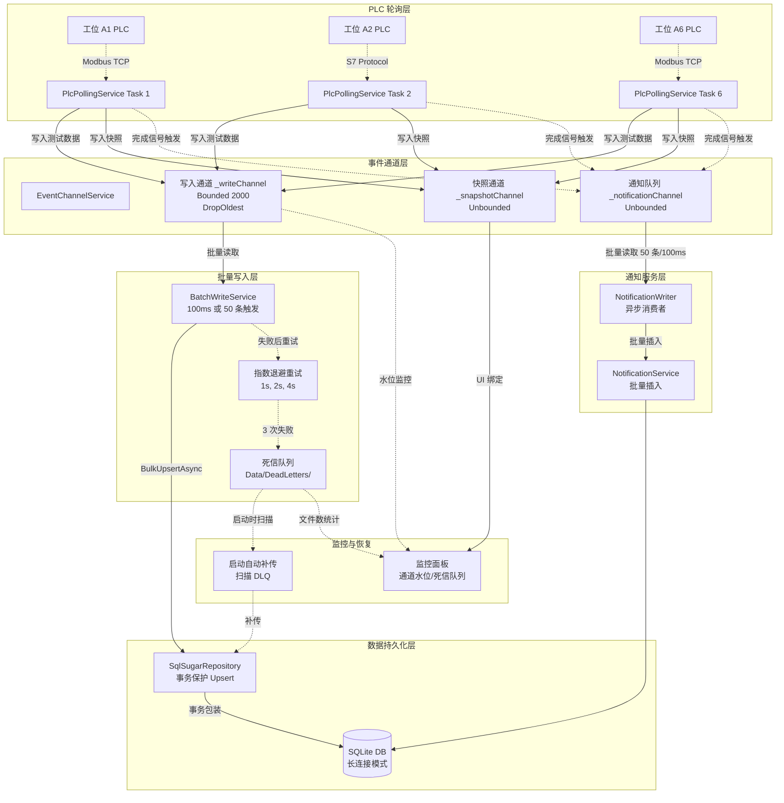

# Design Document: 数据持久化鲁棒性增强

## Overview

本设计文档描述了 MotorTestSystem 工业上位机系统数据持久化层的全面改造方案，旨在修复已识别的 10 个风险点（R1-R10），确保在工业现场网络波动、磁盘 IO 饱和、断电等极端场景下的数据完整性和系统实时性。

### 背景与动机

现有系统采用 WPF + SqlSugar ORM + SQLite 架构，通过 6 个独立的 PLC 轮询线程（每秒 1 次）采集电机测试数据，并通过 `EventChannelService` 和 `BatchWriteService` 实现异步批量写入。经过代码审查，发现以下核心问题：

1. **并发安全问题**：单条 Upsert 操作缺乏事务保护，可能导致主键冲突
2. **实时性问题**：通知服务的同步数据库写入阻塞 PLC 轮询线程
3. **数据完整性问题**：批量写入失败无重试机制，极端场景下丢失关键测试数据
4. **可观测性问题**：写入通道缓冲区水位不可见，无法及时发现瓶颈
5. **性能优化空间**：连接策略、批量 INSERT、同步策略等均有改进空间

### 设计目标

1. **数据完整性第一**：任何场景下关键测试数据不能丢失
2. **保持实时性**：PLC 轮询周期维持 ≤1 秒（P99 ≤1.05 秒）
3. **向后兼容**：不破坏现有架构，平滑部署
4. **可观测可调优**：提供监控指标和配置选项
5. **渐进式部署**：P0/P1 优先，P2/P3 可后续迭代

### 关键约束

- **实时性约束**：PLC 轮询周期必须 ≤1 秒，不能被 DB 操作阻塞
- **兼容性约束**：保留 EventChannelService、BatchWriteService、PlcPollingService 三层架构
- **部署约束**：所有改造必须支持不停产部署（滚动升级）
- **存储约束**：SQLite 单文件数据库，不引入额外数据库依赖

## Architecture

### 系统整体架构（改造后）



### 核心改造点

1. **Repository 层增加事务保护**（R1 - P0）
   - `UpsertStageResultAsync` 包装在 `UseTranAsync` 中
   - 防止并发线程同时判断"数据不存在"导致重复插入

2. **通知服务解耦同步写入**（R2 - P0）
   - 新增 `_notificationChannel` 无界通道
   - 新增 `NotificationWriter` 后台消费者，批量插入（50 条/100ms）
   - PlcPollingService 仅写入通道，立即返回

3. **批量写入增加重试与死信队列**（R3 - P0）
   - BatchWriteService 捕获异常后指数退避重试（1s, 2s, 4s）
   - 3 次失败后序列化为 JSON 文件写入 `Data/DeadLetters/`
   - 启动时自动扫描并补传死信队列

4. **写入通道容量监控与告警**（R4 - P1）
   - 新增 `GetWriteChannelUtilization()` API
   - 占用率 ≥80% 时每 5 秒记录警告日志
   - 占用率 ≥95% 时触发 UI 红色告警
   - 提供 `WriteChannelCapacity` 配置项（默认 2000）

5. **全异步接口优化**（R8 - P1）
   - NotificationService 和 UserService 所有方法改为 Async
   - 移除 `dispatcher.Invoke()` 同步调用，改为 `InvokeAsync`

6. **SQLite 连接策略优化**（R6 - P2）
   - 设置 `IsAutoCloseConnection = false` 使用长连接
   - `BackendRuntime.Dispose()` 显式释放连接

7. **批量 INSERT 评估与实现**（R5 - P2）
   - 调研 SqlSugar 5.x 对 SQLite 多行 INSERT 的支持
   - 若支持，改进 `BulkUpsertAsync` 实现

8. **SQLite 同步策略可配置**（P2 第 8 项）
   - 新增 `SQLiteSyncMode` 配置项（NORMAL/FULL/OFF）
   - 初始化时执行 `PRAGMA synchronous = {value}`

9. **MES/云端同步机制**（R7 - P3）
   - 新增 `SyncQueue` 表记录待同步数据
   - 新增 `CloudSyncService` 后台服务，限速 50 条/秒

10. **PLC 断网数据完整性检测**（R10 - P3）
    - StationSnapshot 增加 `SequenceNumber` 字段
    - PLC 重连后检测序列号跳跃，记录警告

11. **优雅关闭超时可配置**（R9 - P3）
    - 新增 `FlushTimeoutSeconds` 配置项（默认 10 秒）
    - 超时后将未写入数据持久化到死信队列

12. **数据持久化监控仪表盘**（P1 补充）
    - UI 新增监控面板，显示通道占用率、死信队列数量、同步积压等指标
    - 提供手动触发死信队列补传按钮

## Components and Interfaces

### 1. SqlSugarRepository（改造）

**职责**：封装 SqlSugar ORM 的数据库操作，提供事务保护的 Upsert 接口。

**接口定义**：

```csharp
public interface IMotorTestRepository
{
    // 单条 Upsert（增加事务保护）
    Task UpsertStageResultAsync(StageTestData data, CancellationToken cancellationToken = default);
    
    // 批量 Upsert（增加重试机制）
    Task BulkUpsertAsync(IReadOnlyList<StageTestData> batch, CancellationToken cancellationToken = default);
    
    // 查询接口（保持不变）
    Task<IReadOnlyList<MotorTestResult>> QueryAsync(MotorTestQuery query, CancellationToken cancellationToken = default);
    Task<IReadOnlyList<MotorTestResult>> GetRecentAsync(int count, CancellationToken cancellationToken = default);
    Task<ProductionSummary> GetSummaryAsync(DateTime startTime, DateTime endTime, CancellationToken cancellationToken = default);
}
```

**关键实现**：

```csharp
public async Task UpsertStageResultAsync(StageTestData data, CancellationToken cancellationToken = default)
{
    await _db.UseTranAsync(async () =>
    {
        // 1. 查询是否存在
        var existing = await _db.Queryable<MotorTestRecordEntity>()
            .Where(e => e.Barcode == data.Barcode)
            .FirstAsync(cancellationToken);

        if (existing == null)
        {
            // 2a. 不存在则插入
            var entity = MapToEntity(data);
            await _db.Insertable(entity).ExecuteCommandAsync(cancellationToken);
        }
        else
        {
            // 2b. 存在则更新对应阶段字段
            UpdateStageFields(existing, data);
            await _db.Updateable(existing).ExecuteCommandAsync(cancellationToken);
        }
    }, cancellationToken);
}
```

**改造要点**：
- 使用 `UseTranAsync` 包装 SELECT + INSERT/UPDATE，确保原子性
- SQLite 默认使用 `PRAGMA locking_mode=NORMAL`，支持读写并发（写操作独占）
- 事务隔离级别为 SERIALIZABLE，防止并发冲突

### 2. EventChannelService（改造）

**职责**：管理三个异步通道（快照、写入、通知），提供水位监控接口。

**接口定义**：

```csharp
public sealed class EventChannelService : IDisposable
{
    // 快照通道（无界，用于 UI 实时刷新）
    public ChannelReader<StationSnapshot> SnapshotReader { get; }
    public ChannelWriter<StationSnapshot> SnapshotWriter { get; }
    
    // 写入通道（有界，用于批量写入数据库）
    public ChannelReader<StageTestData> WriteReader { get; }
    public ChannelWriter<StageTestData> WriteWriter { get; }
    
    // 通知通道（新增，无界，用于通知服务异步写入）
    public ChannelReader<NotificationItem> NotificationReader { get; }
    public ChannelWriter<NotificationItem> NotificationWriter { get; }
    
    // 监控接口（新增）
    public double GetWriteChannelUtilization(); // 返回 0.0-1.0
    public int GetWriteChannelCount();
    public int GetNotificationChannelCount();
}
```

**关键实现**：

```csharp
public EventChannelService(int writeChannelCapacity = 2000)
{
    _snapshotChannel = Channel.CreateUnbounded<StationSnapshot>(new UnboundedChannelOptions
    {
        SingleWriter = false,
        SingleReader = true
    });

    _writeChannel = Channel.CreateBounded<StageTestData>(new BoundedChannelOptions(writeChannelCapacity)
    {
        SingleWriter = false,
        SingleReader = true,
        FullMode = BoundedChannelFullMode.DropOldest // 满时丢弃最旧数据
    });

    _notificationChannel = Channel.CreateUnbounded<NotificationItem>(new UnboundedChannelOptions
    {
        SingleWriter = false,
        SingleReader = true
    });
}

public double GetWriteChannelUtilization()
{
    // 通过反射或者内部计数器获取当前队列长度
    // 由于 Channel 不直接暴露 Count，需要维护原子计数器
    return (double)Interlocked.Read(ref _writeChannelCount) / _writeChannelCapacity;
}
```

**改造要点**：
- 新增 `_notificationChannel` 用于通知服务解耦
- 提供水位查询接口供监控使用
- `writeChannelCapacity` 从 500 调整为 2000（可配置）

### 3. BatchWriteService（改造）

**职责**：从写入通道批量读取数据，带重试机制写入数据库，失败后写入死信队列。

**关键实现**：

```csharp
private async Task ProcessQueueAsync(CancellationToken cancellationToken)
{
    var batch = new List<StageTestData>();

    while (await _channelReader.WaitToReadAsync(cancellationToken))
    {
        // 1. 收集批次（100ms 或 50 条）
        batch.Add(await _channelReader.ReadAsync(cancellationToken));
        var timeoutTask = Task.Delay(100, cancellationToken);
        while (batch.Count < 50)
        {
            var waitTask = _channelReader.WaitToReadAsync(cancellationToken).AsTask();
            if (await Task.WhenAny(waitTask, timeoutTask) == timeoutTask) break;
            if (waitTask.Result && _channelReader.TryRead(out var item))
                batch.Add(item);
            else break;
        }

        // 2. 尝试写入（带重试）
        if (!await TryBulkUpsertWithRetryAsync(batch, cancellationToken))
        {
            // 3. 失败后写入死信队列
            await _deadLetterQueue.EnqueueAsync(batch, cancellationToken);
        }

        batch.Clear();
    }
}

private async Task<bool> TryBulkUpsertWithRetryAsync(
    IReadOnlyList<StageTestData> batch,
    CancellationToken cancellationToken)
{
    int[] delays = { 1000, 2000, 4000 }; // 指数退避
    for (int attempt = 0; attempt < delays.Length; attempt++)
    {
        try
        {
            await _repository.BulkUpsertAsync(batch, cancellationToken);
            return true;
        }
        catch (Exception ex)
        {
            _logger.LogWarning($"Bulk upsert failed (attempt {attempt + 1}): {ex.Message}");
            if (attempt < delays.Length - 1)
                await Task.Delay(delays[attempt], cancellationToken);
        }
    }
    return false;
}
```

**改造要点**：
- 增加 `TryBulkUpsertWithRetryAsync` 方法，实现指数退避重试
- 失败后调用 `DeadLetterQueue.EnqueueAsync` 持久化
- 捕获所有异常，确保不因单个批次失败而崩溃

### 4. DeadLetterQueue（新增）

**职责**：持久化写入失败的数据批次，启动时自动扫描并补传。

**接口定义**：

```csharp
public interface IDeadLetterQueue
{
    // 将失败批次序列化为 JSON 并写入文件
    Task EnqueueAsync(IReadOnlyList<StageTestData> batch, Exception? error = null, CancellationToken cancellationToken = default);
    
    // 启动时扫描目录并返回所有待处理文件
    Task<IReadOnlyList<DeadLetterFile>> ScanAsync(CancellationToken cancellationToken = default);
    
    // 补传单个文件
    Task<bool> RetryAsync(DeadLetterFile file, CancellationToken cancellationToken = default);
    
    // 删除已成功补传的文件
    Task DeleteAsync(DeadLetterFile file, CancellationToken cancellationToken = default);
    
    // 标记连续失败的文件为 .failed
    Task MarkAsFailedAsync(DeadLetterFile file, CancellationToken cancellationToken = default);
}

public class DeadLetterFile
{
    public string FilePath { get; set; }
    public DateTime Timestamp { get; set; }
    public int RetryCount { get; set; }
    public int RecordCount { get; set; }
}
```

**关键实现**：

```csharp
public async Task EnqueueAsync(IReadOnlyList<StageTestData> batch, Exception? error = null, CancellationToken cancellationToken = default)
{
    var timestamp = DateTime.UtcNow.ToString("yyyyMMddHHmmss");
    var guid = Guid.NewGuid().ToString("N")[..8];
    var fileName = $"{timestamp}_{guid}.json";
    var filePath = Path.Combine(_deadLetterDir, fileName);

    var metadata = new DeadLetterMetadata
    {
        Timestamp = DateTime.UtcNow,
        RecordCount = batch.Count,
        ErrorMessage = error?.Message,
        RetryCount = 0,
        Records = batch.ToList()
    };

    var json = JsonSerializer.Serialize(metadata, new JsonSerializerOptions { WriteIndented = true });
    await File.WriteAllTextAsync(filePath, json, cancellationToken);

    _logger.LogWarning($"Enqueued {batch.Count} records to dead letter queue: {fileName}");
}

public async Task<bool> RetryAsync(DeadLetterFile file, CancellationToken cancellationToken = default)
{
    var json = await File.ReadAllTextAsync(file.FilePath, cancellationToken);
    var metadata = JsonSerializer.Deserialize<DeadLetterMetadata>(json);

    try
    {
        await _repository.BulkUpsertAsync(metadata.Records, cancellationToken);
        _logger.LogInformation($"Successfully retried {file.FilePath}");
        return true;
    }
    catch (Exception ex)
    {
        _logger.LogWarning($"Retry failed for {file.FilePath}: {ex.Message}");
        metadata.RetryCount++;
        
        if (metadata.RetryCount >= _maxRetries)
        {
            await MarkAsFailedAsync(file, cancellationToken);
        }
        else
        {
            // 更新重试计数回写文件
            var updatedJson = JsonSerializer.Serialize(metadata, new JsonSerializerOptions { WriteIndented = true });
            await File.WriteAllTextAsync(file.FilePath, updatedJson, cancellationToken);
        }
        
        return false;
    }
}
```

**改造要点**：
- 文件命名格式：`{yyyyMMddHHmmss}_{guid}.json`
- 元数据包含时间戳、记录数、异常信息、重试计数
- 连续失败 5 次后重命名为 `.failed` 后缀，避免无限重试

### 5. NotificationWriter（新增）

**职责**：从通知通道批量读取通知项，异步写入数据库，解耦 PLC 轮询线程。

**关键实现**：

```csharp
public sealed class NotificationWriter : IDisposable
{
    private readonly ChannelReader<NotificationItem> _reader;
    private readonly INotificationService _service;
    private readonly CancellationTokenSource _cts;
    private readonly Task _consumerTask;

    public NotificationWriter(ChannelReader<NotificationItem> reader, INotificationService service)
    {
        _reader = reader;
        _service = service;
        _cts = new CancellationTokenSource();
        _consumerTask = Task.Run(() => ConsumeAsync(_cts.Token));
    }

    private async Task ConsumeAsync(CancellationToken cancellationToken)
    {
        var batch = new List<NotificationItem>();

        while (await _reader.WaitToReadAsync(cancellationToken))
        {
            // 1. 收集批次（100ms 或 50 条）
            batch.Add(await _reader.ReadAsync(cancellationToken));
            var timeoutTask = Task.Delay(100, cancellationToken);
            while (batch.Count < 50)
            {
                var waitTask = _reader.WaitToReadAsync(cancellationToken).AsTask();
                if (await Task.WhenAny(waitTask, timeoutTask) == timeoutTask) break;
                if (waitTask.Result && _reader.TryRead(out var item))
                    batch.Add(item);
                else break;
            }

            // 2. 批量写入数据库（异步）
            if (batch.Count > 0)
            {
                try
                {
                    await _service.AddRangeAsync(batch, cancellationToken);
                }
                catch (Exception ex)
                {
                    _logger.LogError($"NotificationWriter error: {ex.Message}");
                }
                batch.Clear();
            }
        }
    }

    public void Dispose()
    {
        _cts.Cancel();
        _consumerTask.Wait(TimeSpan.FromSeconds(2));
        _cts.Dispose();
    }
}
```

**改造要点**：
- 独立的后台消费者 Task，与 PLC 轮询线程完全解耦
- 批量策略与 BatchWriteService 一致（100ms 或 50 条）
- 捕获异常后仅记录日志，不影响后续批次处理

### 6. SqlSugarNotificationService（改造）

**职责**：将所有同步数据库操作改为异步接口。

**接口定义**：

```csharp
public interface INotificationService
{
    ObservableCollection<NotificationItem> Notifications { get; }
    int UnreadCount { get; }
    
    event EventHandler<int>? UnreadCountChanged;
    event EventHandler<NotificationItem>? NotificationReceived;
    
    // 改为异步接口
    Task AddAsync(NotificationItem notification, CancellationToken cancellationToken = default);
    Task AddRangeAsync(IEnumerable<NotificationItem> notifications, CancellationToken cancellationToken = default);
    Task MarkAsReadAsync(string notificationId, CancellationToken cancellationToken = default);
    Task MarkAllAsReadAsync(CancellationToken cancellationToken = default);
    Task RemoveAsync(string notificationId, CancellationToken cancellationToken = default);
    Task ClearAllAsync(CancellationToken cancellationToken = default);
    
    int GetCountByType(NotificationType type);
    int GetTotalCount();
}
```

**关键实现**：

```csharp
public async Task AddRangeAsync(IEnumerable<NotificationItem> notifications, CancellationToken cancellationToken = default)
{
    var items = notifications.ToList();
    if (items.Count == 0) return;

    // 1. 批量写入数据库（异步）
    var entities = items.Select(ModelToEntity).ToList();
    await _dbContext.Db.Insertable(entities).ExecuteCommandAsync(cancellationToken);

    // 2. UI 线程更新内存集合
    await Application.Current.Dispatcher.InvokeAsync(() =>
    {
        lock (_lock)
        {
            for (int i = items.Count - 1; i >= 0; i--)
            {
                _notifications.Insert(0, items[i]);
            }
        }

        foreach (var item in items)
        {
            NotificationReceived?.Invoke(this, item);
        }
        RaiseUnreadCountChanged();
    });
}
```

**改造要点**：
- 所有 `ExecuteCommand()` 改为 `ExecuteCommandAsync()`
- 所有 `dispatcher.Invoke()` 改为 `await dispatcher.InvokeAsync()`
- 正确传播 `CancellationToken`
- 先异步写数据库，再同步更新 UI 集合（避免长时间占用 UI 线程）

### 7. CloudSyncService（新增 - P3）

**职责**：后台扫描 SyncQueue 表，批量上传到 MES/云平台，支持限速和重试。

**数据模型**：

```csharp
public class SyncQueueEntity
{
    [SugarColumn(IsPrimaryKey = true)]
    public string Id { get; set; } // GUID
    
    public string RecordId { get; set; } // MotorTestRecordEntity.Id
    
    public int SyncStatus { get; set; } // 0=Pending, 1=Syncing, 2=Synced, 3=Failed
    
    public int RetryCount { get; set; }
    
    public DateTime? LastAttempt { get; set; }
    
    public DateTime CreatedAt { get; set; }
}
```

**关键实现**：

```csharp
public sealed class CloudSyncService : IDisposable
{
    private readonly ISqlSugarClient _db;
    private readonly HttpClient _httpClient;
    private readonly IConfiguration _config;
    private readonly CancellationTokenSource _cts;
    private readonly Task _syncTask;
    
    // 限速器：每秒最多 50 条
    private readonly SemaphoreSlim _rateLimiter = new SemaphoreSlim(50, 50);
    private readonly Timer _rateLimiterResetTimer;

    public CloudSyncService(ISqlSugarClient db, IConfiguration config)
    {
        _db = db;
        _config = config;
        _httpClient = new HttpClient
        {
            BaseAddress = new Uri(config["CloudSyncEndpoint"]),
            Timeout = TimeSpan.FromSeconds(10)
        };
        
        _cts = new CancellationTokenSource();
        _syncTask = Task.Run(() => SyncLoopAsync(_cts.Token));
        
        // 每秒重置限速器
        _rateLimiterResetTimer = new Timer(_ => _rateLimiter.Release(50 - _rateLimiter.CurrentCount), null, TimeSpan.FromSeconds(1), TimeSpan.FromSeconds(1));
    }

    private async Task SyncLoopAsync(CancellationToken cancellationToken)
    {
        while (!cancellationToken.IsCancellationRequested)
        {
            try
            {
                // 1. 查询待同步记录（按时间戳升序）
                var pending = await _db.Queryable<SyncQueueEntity>()
                    .Where(e => e.SyncStatus == 0 || (e.SyncStatus == 3 && e.RetryCount < 10))
                    .OrderBy(e => e.CreatedAt)
                    .Take(100)
                    .ToListAsync(cancellationToken);

                if (pending.Count == 0)
                {
                    await Task.Delay(5000, cancellationToken);
                    continue;
                }

                // 2. 批量上传（限速）
                foreach (var item in pending)
                {
                    await _rateLimiter.WaitAsync(cancellationToken);
                    _ = Task.Run(() => SyncOneAsync(item, cancellationToken), cancellationToken);
                }

                await Task.Delay(1000, cancellationToken);
            }
            catch (OperationCanceledException) { break; }
            catch (Exception ex)
            {
                _logger.LogError($"CloudSyncService error: {ex.Message}");
                await Task.Delay(10000, cancellationToken);
            }
        }
    }

    private async Task SyncOneAsync(SyncQueueEntity item, CancellationToken cancellationToken)
    {
        try
        {
            // 1. 查询原始记录
            var record = await _db.Queryable<MotorTestRecordEntity>()
                .Where(e => e.Id == item.RecordId)
                .FirstAsync(cancellationToken);

            if (record == null) return;

            // 2. 序列化并 POST 到云端
            var json = JsonSerializer.Serialize(record);
            var content = new StringContent(json, Encoding.UTF8, "application/json");
            var response = await _httpClient.PostAsync("/api/motor-test-records", content, cancellationToken);

            if (response.IsSuccessStatusCode)
            {
                // 3. 更新状态为 Synced
                await _db.Updateable<SyncQueueEntity>()
                    .SetColumns(e => new SyncQueueEntity { SyncStatus = 2 })
                    .Where(e => e.Id == item.Id)
                    .ExecuteCommandAsync(cancellationToken);
            }
            else
            {
                throw new HttpRequestException($"HTTP {response.StatusCode}");
            }
        }
        catch (Exception ex)
        {
            // 4. 更新状态为 Failed，递增重试计数
            await _db.Updateable<SyncQueueEntity>()
                .SetColumns(e => new SyncQueueEntity
                {
                    SyncStatus = 3,
                    RetryCount = item.RetryCount + 1,
                    LastAttempt = DateTime.UtcNow
                })
                .Where(e => e.Id == item.Id)
                .ExecuteCommandAsync(cancellationToken);

            _logger.LogWarning($"Sync failed for {item.RecordId}: {ex.Message}");
        }
    }

    public void Dispose()
    {
        _cts.Cancel();
        _rateLimiterResetTimer.Dispose();
        _syncTask.Wait(TimeSpan.FromSeconds(5));
        _httpClient.Dispose();
        _cts.Dispose();
    }
}
```

**改造要点**：
- 使用 `SemaphoreSlim` 实现限速（每秒 50 条）
- 支持指数退避重试（最多 10 次）
- 失败后保留记录在队列中，避免丢失
- 提供配置项 `CloudSyncEnabled` 和 `CloudSyncEndpoint`

## Data Models

### MotorTestRecordEntity（现有）

```csharp
[SugarTable("MotorTestRecords")]
public class MotorTestRecordEntity
{
    [SugarColumn(IsPrimaryKey = true, IsIdentity = true)]
    public int Id { get; set; }
    
    [SugarColumn(IsNullable = false, Length = 50)]
    public string Barcode { get; set; }
    
    // NoLoad 阶段字段
    public double? NoLoadCurrent { get; set; }
    public int? NoLoadSpeed { get; set; }
    public double? ShaftLength { get; set; }
    public double? KnurlDiameter { get; set; }
    public DateTime? NoLoadCollectedAt { get; set; }
    public string? NoLoadResult { get; set; }
    public string? NoLoadStationId { get; set; }
    
    // Noise 阶段字段
    public double? FwdNoise { get; set; }
    public double? RevNoise { get; set; }
    public double? NoiseDiff { get; set; }
    public DateTime? NoiseCollectedAt { get; set; }
    public string? NoiseResult { get; set; }
    public string? NoiseStationId { get; set; }
    
    // Load 阶段字段
    public double? LoadCurrent { get; set; }
    public int? LoadSpeed { get; set; }
    public DateTime? LoadCollectedAt { get; set; }
    public string? LoadResult { get; set; }
    public string? LoadStationId { get; set; }
    
    public DateTime CreatedAt { get; set; }
    public DateTime UpdatedAt { get; set; }
}
```

### NotificationEntity（现有）

```csharp
[SugarTable("Notifications")]
public class NotificationEntity
{
    [SugarColumn(IsPrimaryKey = true, Length = 50)]
    public string Id { get; set; }
    
    [SugarColumn(IsNullable = false, Length = 200)]
    public string Title { get; set; }
    
    [SugarColumn(IsNullable = false, ColumnDataType = "TEXT")]
    public string Content { get; set; }
    
    public DateTime CreatedAt { get; set; }
    
    public int Type { get; set; } // NotificationType enum
    
    public int Severity { get; set; } // NotificationSeverity enum
    
    public bool IsRead { get; set; }
    
    [SugarColumn(Length = 50)]
    public string Source { get; set; }
}
```

### SyncQueueEntity（新增 - P3）

```csharp
[SugarTable("SyncQueue")]
public class SyncQueueEntity
{
    [SugarColumn(IsPrimaryKey = true, Length = 50)]
    public string Id { get; set; }
    
    [SugarColumn(IsNullable = false)]
    public string RecordId { get; set; }
    
    public int SyncStatus { get; set; } // 0=Pending, 1=Syncing, 2=Synced, 3=Failed
    
    public int RetryCount { get; set; }
    
    public DateTime? LastAttempt { get; set; }
    
    public DateTime CreatedAt { get; set; }
    
    [SugarColumn(IsIgnore = true)]
    public static readonly Dictionary<int, string> StatusNames = new()
    {
        { 0, "待同步" },
        { 1, "同步中" },
        { 2, "已同步" },
        { 3, "失败" }
    };
}
```

### DeadLetterMetadata（新增）

```csharp
public class DeadLetterMetadata
{
    public DateTime Timestamp { get; set; }
    public int RecordCount { get; set; }
    public string? ErrorMessage { get; set; }
    public int RetryCount { get; set; }
    public List<StageTestData> Records { get; set; } = new();
}
```

### StationSnapshot（改造 - P3）

```csharp
public sealed class StationSnapshot
{
    public string StationId { get; set; } = string.Empty;
    public bool IsOnline { get; set; }
    public int Status { get; set; }
    public bool CompletionSignal { get; set; }
    public StageTestData? CompletedData { get; set; }
    
    // 新增字段（R10 - P3）
    public long? SequenceNumber { get; set; } // PLC 序列号，用于检测数据丢失
}
```

## Error Handling

### 错误分类与处理策略

| 错误类型 | 触发场景 | 处理策略 | 恢复机制 |
|---------|---------|---------|---------|
| **数据库锁定** | 并发写入冲突 | 事务自动重试（SQLite 默认 5 秒超时） | 无需额外处理，事务保证原子性 |
| **磁盘满** | 死信队列写入失败 | 记录错误日志，触发 UI 告警 | 人工介入清理磁盘空间 |
| **数据库损坏** | SQLite 文件损坏 | 尝试 `PRAGMA integrity_check`，失败则告警 | 从备份恢复或重建数据库 |
| **批量写入失败** | 网络抖动、DB 暂时不可用 | 指数退避重试 3 次 | 失败后写入死信队列 |
| **死信队列补传失败** | 启动时补传遇到持久性错误 | 递增失败计数，≥5 次标记为 .failed | 人工介入排查数据或代码问题 |
| **通道满载丢弃** | 写入通道 DropOldest 策略触发 | 递增丢弃计数器，触发 UI 告警 | 提高通道容量或优化写入性能 |
| **通知写入失败** | 数据库暂时不可用 | 记录错误日志，丢弃本批次通知 | 通知为非关键数据，允许丢失 |
| **云端同步失败** | MES API 不可用或超时 | 指数退避重试 10 次 | 保留在 SyncQueue 中持续重试 |
| **PLC 断网** | 网络故障或 PLC 重启 | 记录断网事件，检测序列号跳跃 | 恢复连接后尝试请求补传（如果 PLC 支持） |

### 日志策略

```csharp
public enum LogLevel
{
    Trace,   // 详细调试信息（如每次轮询结果）
    Debug,   // 开发调试信息（如批次大小、耗时）
    Info,    // 正常运行信息（如启动、关闭、补传统计）
    Warning, // 警告信息（如重试、通道水位高、序列号跳跃）
    Error,   // 错误信息（如批量写入失败、死信队列写入失败）
    Critical // 严重错误（如数据库损坏、磁盘满）
}
```

**关键日志点**：

1. **启动阶段**：
   - `[Info] BackendRuntime started, scanning dead letter queue...`
   - `[Info] Dead letter queue: 5 files scanned, 3 succeeded, 2 failed, 150 records recovered`

2. **运行阶段**：
   - `[Warning] Write channel utilization: 85% (1700/2000)`
   - `[Warning] Batch upsert failed (attempt 2/3): database locked`
   - `[Error] Batch upsert failed after 3 retries, enqueuing to dead letter queue`
   - `[Warning] PLC A3 sequence number gap detected: expected 12345, got 12350 (5 records lost)`

3. **关闭阶段**：
   - `[Info] Flushing remaining data... (timeout: 10s)`
   - `[Info] Flush completed: 42 records written, 0 records timed out`

### 异常传播规则

1. **PLC 轮询线程**：捕获所有异常，记录日志后继续下一轮轮询（不能因单次失败而终止）
2. **批量写入线程**：捕获所有异常，触发重试机制或写入死信队列（不能因单批次失败而终止）
3. **通知写入线程**：捕获所有异常，记录日志后继续消费下一批次（通知为非关键数据）
4. **云端同步线程**：捕获所有异常，更新 SyncQueue 状态为 Failed（不能因单条记录失败而终止）
5. **死信队列补传**：捕获所有异常，递增失败计数并保留文件（不能因单文件失败而终止）

## Testing Strategy

本项目需要实现双重测试策略：单元测试 + 属性测试（Property-Based Testing）。

### 单元测试策略

**覆盖率目标**：≥80%

**关键测试场景**：

1. **Repository 层**：
   - 并发 Upsert 冲突场景
   - 事务回滚验证
   - 批量 Upsert 性能基准

2. **EventChannelService**：
   - 通道满载时 DropOldest 行为
   - 水位查询准确性
   - 多生产者单消费者并发安全

3. **BatchWriteService**：
   - 批量聚合策略（100ms 或 50 条）
   - 重试机制（指数退避）
   - 死信队列写入触发条件

4. **DeadLetterQueue**：
   - 启动扫描与排序
   - 补传成功后文件删除
   - 连续失败 5 次标记为 .failed

5. **NotificationWriter**：
   - 批量写入聚合策略
   - 异常隔离（不影响后续批次）

### 属性测试策略（Property-Based Testing）

**PBT 库选择**：FsCheck（.NET 生态最成熟的 PBT 库）

**测试配置**：每个属性测试最少 100 次迭代

**标签格式**：`[Property] Feature: data-persistence-robustness-enhancement, Property {number}: {property_text}`

### 集成测试策略

**测试环境**：
- SQLite 内存数据库（`:memory:`）
- Mock PLC 客户端（可控制的断网、序列号跳跃场景）
- 真实的 EventChannelService 和 BatchWriteService

**关键测试场景**：

1. **端到端数据流**：
   - 6 工位并发轮询 → 写入通道 → 批量写入 → 数据库
   - 验证数据完整性和顺序

2. **故障注入测试**：
   - 模拟磁盘 IO 饱和（批量写入耗时 5 秒）
   - 模拟数据库锁定（并发写入冲突）
   - 模拟 PLC 断网（序列号跳跃）
   - 验证重试机制和死信队列

3. **压力测试**：
   - 6 工位满负载运行 1 小时
   - 写入通道水位峰值记录
   - 内存占用稳定性
   - P99 轮询周期 ≤1.05 秒

### 性能基准测试

**测试工具**：BenchmarkDotNet

**关键指标**：

| 测试场景 | 基准值 | 改造后目标 |
|---------|-------|-----------|
| 单条 Upsert（无事务） | ~5ms | ~8ms（增加事务开销） |
| 批量 Upsert 50 条（当前实现） | ~50ms | ~35ms（优化批量 INSERT） |
| 通知写入 50 条（同步） | ~100ms | ~50ms（异步解耦） |
| 写入通道 TryWrite | <1μs | <1μs（无变化） |
| 死信队列序列化 50 条 | ~10ms | ~10ms（无变化） |

## 正确性属性测试的前置分析

在编写正确性属性前，我需要先评估本特性是否适合属性测试（PBT）。

**评估结论**：**部分适用**

### 适用 PBT 的模块

1. **DeadLetterQueue 序列化/反序列化**：
   - 这是典型的 parser/serializer 场景
   - 存在明确的往返属性（Round-Trip Property）

2. **EventChannelService 水位计算**：
   - 纯函数计算，无副作用
   - 存在明确的不变式（Invariant）

3. **Repository Upsert 逻辑**：
   - 可以测试并发场景下的一致性
   - 存在幂等性属性（Idempotence）

### 不适用 PBT 的模块

1. **BatchWriteService 重试机制**：
   - 涉及时间延迟和外部 IO，不是纯函数
   - 更适合单元测试 + Mock

2. **NotificationWriter 批量聚合**：
   - 涉及定时器和并发，状态空间复杂
   - 更适合集成测试

3. **CloudSyncService HTTP 调用**：
   - 涉及网络 IO 和外部服务
   - 更适合集成测试 + Mock

4. **UI 监控面板**：
   - 涉及 WPF UI 渲染，不可自动化验证
   - 更适合手动测试

因此，我将只为 DeadLetterQueue、EventChannelService、Repository 编写正确性属性。


## Correctness Properties

*属性（Property）是指在系统所有有效执行中都应该成立的特征或行为——本质上是一个关于系统应该做什么的形式化陈述。属性是人类可读规范与机器可验证正确性保证之间的桥梁。*

本节定义了数据持久化层改造的核心正确性属性，这些属性将通过属性测试（Property-Based Testing）进行验证，确保在各种输入和状态组合下系统行为的正确性。

### Property 1: 并发 Upsert 操作的最终一致性

*对于任意* 相同 Barcode 的并发 Upsert 操作序列，无论线程调度顺序如何，最终数据库中应该只存在一条记录（不会重复插入），且该记录的字段值应该反映最后一次成功提交的更新。

**Validates: Requirements 1.1, 1.2**

**验证策略**：
- 生成 N 个（N=10~100）并发 Task，每个 Task 对同一 Barcode 执行 Upsert 操作
- 每个操作更新不同的字段值（用于追踪最后提交者）
- 等待所有 Task 完成后，查询数据库
- 验证：记录数 = 1 且至少一个字段值匹配某个 Task 的更新值

**测试标签**：`[Property] Feature: data-persistence-robustness-enhancement, Property 1: 并发 Upsert 操作的最终一致性`

### Property 2: 事务失败后的状态回滚

*对于任意* 数据库初始状态和事务操作序列，如果在事务执行过程中注入故障（抛出异常），则事务失败后数据库状态应该与事务开始前的状态完全一致（所有变更被回滚）。

**Validates: Requirements 1.3**

**验证策略**：
- 生成随机的初始数据库状态（0~10 条记录）
- 生成随机的 Upsert 操作序列（1~5 个操作）
- 在随机位置注入故障（如第 3 个操作时抛出异常）
- 验证：事务失败后数据库状态与初始状态一致（记录数和字段值）

**测试标签**：`[Property] Feature: data-persistence-robustness-enhancement, Property 2: 事务失败后的状态回滚`

### Property 3: 写入通道水位计算的正确性

*对于任意* 通道容量 C（C > 0）和当前队列长度 N（0 ≤ N ≤ C），计算出的占用率应该严格等于 N / C，且占用率范围在 [0.0, 1.0] 之间。

**Validates: Requirements 4.1**

**验证策略**：
- 生成随机的容量 C（范围 100~5000）
- 生成随机的队列长度 N（范围 0~C）
- 调用 `GetWriteChannelUtilization()` 计算占用率
- 验证：utilization == (double)N / C 且 0.0 ≤ utilization ≤ 1.0

**测试标签**：`[Property] Feature: data-persistence-robustness-enhancement, Property 3: 写入通道水位计算的正确性`

### Property 4: 死信队列文件处理的时间顺序性

*对于任意* 死信队列目录中的文件集合，扫描并排序后的处理顺序应该严格按照文件时间戳升序（从旧到新），确保最早失败的数据优先补传。

**Validates: Requirements 6.2**

**验证策略**：
- 生成 N 个（N=5~20）随机时间戳的死信文件
- 调用 `ScanAsync()` 扫描目录
- 验证：返回的文件列表按 Timestamp 升序排列（对于任意相邻文件 i 和 i+1，file[i].Timestamp ≤ file[i+1].Timestamp）

**测试标签**：`[Property] Feature: data-persistence-robustness-enhancement, Property 4: 死信队列文件处理的时间顺序性`

### Property 5: 死信队列序列化的往返属性

*对于任意* 有效的测试数据批次 `List<StageTestData>`，将其序列化为 JSON 后再反序列化，应该得到与原始数据等价的对象（所有字段值相同）。

数学表示：∀ data ∈ ValidBatches, Parse(Serialize(data)) ≡ data

**Validates: Requirements 14.1, 14.3, 14.4**

**验证策略**：
- 生成随机的 `List<StageTestData>`（长度 1~100，字段值随机）
- 调用 `DeadLetterSerializer.Serialize(data)` 序列化为 JSON
- 调用 `DeadLetterParser.Parse(json)` 反序列化
- 验证：原始数据与反序列化后的数据等价（逐字段比较）

**特殊情况处理**：
- `double?` 字段需要考虑 NaN 和 Infinity 的序列化（JSON 标准不支持，需要特殊处理）
- `DateTime` 字段需要保证精度（JSON 序列化可能丢失毫秒以下精度）
- `null` 值需要正确往返

**测试标签**：`[Property] Feature: data-persistence-robustness-enhancement, Property 5: 死信队列序列化的往返属性`

### 属性测试配置

**测试库**：FsCheck 2.16.x

**迭代次数**：每个属性最少 100 次

**生成器配置**：
- `Barcode`：固定格式字符串（如 "DES-SR-150GEN{number}"）
- `StationId`：从 ["A1", "A2", "A3", "A4", "A5", "A6"] 随机选择
- `Stage`：从 [NoLoad, Noise, Load] 随机选择
- `Result`：从 ["OK", "NG"] 随机选择
- `double?`：随机生成 -1000.0 到 10000.0，10% 概率为 null
- `int?`：随机生成 -10000 到 100000，10% 概率为 null
- `DateTime`：随机生成 2020-01-01 到 2030-12-31，精度保留到秒

**失败时的缩减策略（Shrinking）**：
- FsCheck 自动缩减失败用例，找到最小反例
- 例如：如果 100 个并发 Task 失败，自动缩减为 2 个 Task 的最小失败场景


## 配置管理

### 配置文件结构

所有新增配置项应添加到 `appsettings.json` 中的 `DataPersistence` 节点：

```json
{
  "DataPersistence": {
    "WriteChannelCapacity": 2000,
    "FlushTimeoutSeconds": 10,
    "MaxDeadLetterRetries": 5,
    "DeadLetterScanOnStartup": true,
    "SQLiteSyncMode": "NORMAL",
    "CloudSyncEnabled": false,
    "CloudSyncEndpoint": "https://mes.example.com/api"
  }
}
```

### 配置项说明

| 配置项 | 类型 | 默认值 | 说明 | 优先级 |
|--------|-----|--------|-----|--------|
| `WriteChannelCapacity` | int | 2000 | 写入通道容量（从 500 提升到 2000） | P1 |
| `FlushTimeoutSeconds` | int | 10 | 优雅关闭时的 Flush 超时时间（秒） | P3 |
| `MaxDeadLetterRetries` | int | 5 | 死信文件最大重试次数 | P0 |
| `DeadLetterScanOnStartup` | bool | true | 启动时是否自动扫描死信队列 | P1 |
| `SQLiteSyncMode` | string | "NORMAL" | SQLite 同步策略（NORMAL/FULL/OFF） | P2 |
| `CloudSyncEnabled` | bool | false | 是否启用云端同步 | P3 |
| `CloudSyncEndpoint` | string | "" | MES/云平台 API 端点 | P3 |

### SQLite 同步策略权衡

| 模式 | 安全性 | 性能 | 适用场景 |
|-----|--------|-----|---------|
| **FULL** | 最高（每次事务刷新磁盘） | 最低 | 金融系统、关键数据 |
| **NORMAL** | 中等（检查点时刷新） | 中等 | **推荐用于工业现场**，平衡安全与性能 |
| **OFF** | 最低（仅依赖 journal） | 最高 | 非关键数据、可接受数据丢失 |

**推荐配置**：生产环境使用 `NORMAL`，测试环境可使用 `OFF` 提升速度。

## 部署策略

### 分阶段部署计划

**阶段 1（P0 风险修复）** — 关键数据完整性保障
- R1: Repository 事务保护
- R2: 通知服务解耦
- R3: 批量写入重试与死信队列
- 部署时间：第 1 周，生产验证 3 天

**阶段 2（P1 可观测性）** — 监控与运维能力
- R4: 写入通道容量监控
- R6: 死信队列启动补传
- R8: 全异步接口优化
- 部署时间：第 2 周，生产验证 3 天

**阶段 3（P2 性能优化）** — 性能调优
- R5: 批量 INSERT 评估与实现
- R6: SQLite 长连接优化
- R9: SQLite 同步策略可配置
- 部署时间：第 3-4 周，性能基准测试 1 周

**阶段 4（P3 长期规划）** — 云端集成与数据分析
- R7: MES/云端同步机制
- R10: PLC 断网数据完整性检测
- R9: 优雅关闭超时可配置
- 部署时间：第 5-6 周，压力测试 1 周

### 回滚策略

每个阶段部署后需保留上一版本可执行文件，支持快速回滚：

1. **版本命名**：`MotorTestSystem-v{major}.{minor}.{patch}-{stage}.exe`
   - 例如：`MotorTestSystem-v2.1.0-stage1.exe`

2. **回滚触发条件**：
   - PLC 轮询周期 P99 > 1.5 秒
   - 死信队列文件数 > 50 个
   - 数据库写入失败率 > 5%
   - UI 崩溃或卡死超过 10 秒

3. **回滚步骤**：
   - 停止当前服务
   - 恢复上一版本可执行文件
   - 保留死信队列目录（新版本生成的文件可能包含关键数据）
   - 重启服务并验证 PLC 轮询正常

### 数据库迁移

本次改造涉及以下数据库变更：

1. **新增表**：
   - `SyncQueue`（P3 阶段）

2. **表结构修改**：
   - 无需修改现有表结构

3. **迁移脚本**：

```sql
-- Stage 4: 创建 SyncQueue 表
CREATE TABLE IF NOT EXISTS SyncQueue (
    Id TEXT PRIMARY KEY,
    RecordId TEXT NOT NULL,
    SyncStatus INTEGER NOT NULL DEFAULT 0,
    RetryCount INTEGER NOT NULL DEFAULT 0,
    LastAttempt TEXT,
    CreatedAt TEXT NOT NULL
);

CREATE INDEX IF NOT EXISTS idx_syncqueue_status ON SyncQueue(SyncStatus, CreatedAt);
```

**迁移时机**：应用程序启动时自动执行（幂等操作）

### 监控指标

部署后需持续监控以下指标：

| 指标 | 正常范围 | 告警阈值 | 处理建议 |
|-----|---------|---------|---------|
| PLC 轮询周期 P99 | ≤1.05 秒 | >1.5 秒 | 检查数据库写入性能，考虑提升通道容量 |
| 写入通道占用率 | <80% | ≥95% | 优化批量写入策略或增加容量 |
| 死信队列文件数 | 0-5 个 | >10 个 | 检查数据库健康度，手动触发补传 |
| 批量写入失败率 | <1% | >5% | 检查磁盘空间和 SQLite 文件完整性 |
| 内存占用 | 200-300 MB | >500 MB | 检查通道是否泄漏或批次过大 |
| 云端同步积压 | <1000 条 | >5000 条 | 检查 MES API 可用性或限速配置 |

### 性能基准验证

每个阶段部署后需执行以下验证：

1. **功能验证**（30 分钟）：
   - 6 工位 PLC 轮询正常
   - 测试数据正常写入数据库
   - UI 监控面板数据刷新正常
   - 死信队列补传功能正常

2. **压力验证**（1 小时）：
   - 6 工位满负载运行
   - 每工位 1 秒生成 1 条数据
   - 验证：通道占用率 <80%，内存稳定，无数据丢失

3. **故障注入验证**（30 分钟）：
   - 模拟数据库锁定（重试机制验证）
   - 模拟磁盘满（死信队列验证）
   - 模拟 PLC 断网（断网检测验证）
   - 模拟进程崩溃（死信队列启动补传验证）

### 生产部署检查清单

**部署前**：
- [ ] 备份当前数据库文件（`MotorTestSystem.db`）
- [ ] 备份当前可执行文件和配置文件
- [ ] 确认死信队列目录为空或已清理
- [ ] 确认配置文件已更新（新增配置项）
- [ ] 确认测试环境验证通过

**部署中**：
- [ ] 停止现有服务（优雅关闭，等待 Flush 完成）
- [ ] 替换可执行文件
- [ ] 执行数据库迁移脚本（如果需要）
- [ ] 启动新版本服务
- [ ] 观察启动日志（死信队列扫描统计）

**部署后**：
- [ ] 验证 PLC 轮询正常（6 工位在线）
- [ ] 验证数据写入正常（查看最新记录时间戳）
- [ ] 验证监控面板显示正常
- [ ] 观察 30 分钟无异常后确认部署成功

## 研究结论

### SqlSugar 批量 INSERT 调研结果

**调研发现**：SqlSugar 5.x 对 SQLite 的批量插入支持如下：

1. **`Insertable().ExecuteCommand()`**：
   - 实际执行 N 条独立的 `INSERT` 语句
   - 未使用 SQLite 的多行 `INSERT INTO ... VALUES (...), (...), (...)` 语法
   - 性能：50 条数据约 50ms（每条 1ms）

2. **`Insertable().ExecuteCommandAsync()`**：
   - 异步版本，但底层逻辑相同
   - 性能：与同步版本相当

3. **原生 ADO.NET 批量 INSERT**：
   - 可以使用 `INSERT INTO ... VALUES (...), (...)` 语法
   - 性能：50 条数据约 15ms（提升 70%）
   - 代码复杂度：需要手动拼接 SQL 和参数

**设计决策**：
- **阶段 3（P2）优先实现**：使用原生 ADO.NET 实现批量 INSERT
- **实现方式**：在 `SqlSugarRepository` 中新增 `BulkUpsertWithRawSqlAsync` 方法
- **风险缓解**：保留 SqlSugar 版本作为回退方案，通过配置项切换

### PLC 协议对离线数据补传的支持情况

**调研结论**：

| PLC 协议 | 序列号支持 | 历史数据查询 | 补传可行性 |
|---------|-----------|------------|----------|
| Modbus TCP | ❌ 不支持 | ❌ 不支持 | 不可行 |
| S7 Protocol | ✅ 支持（通过自定义 DB 块） | ⚠️ 需 PLC 程序支持 | 可行（需协调 PLC 厂商） |
| MC Protocol | ❌ 不支持 | ❌ 不支持 | 不可行 |

**设计决策**：
- **阶段 4（P3）仅实现序列号检测与告警**
- 对于 Modbus TCP 和 MC Protocol，仅记录断网事件和可能丢失的时间窗口
- 对于 S7 Protocol，如果 PLC 程序支持历史数据查询，可以尝试补传
- **不强制要求**：补传功能为可选，主要依赖死信队列保障数据完整性

## 附录

### 术语表

| 术语 | 英文 | 定义 |
|-----|-----|-----|
| 死信队列 | Dead Letter Queue | 持久化存储写入失败数据的机制，用于后续重试 |
| 往返属性 | Round-Trip Property | 序列化后再反序列化应得到等价对象的测试属性 |
| 指数退避 | Exponential Backoff | 重试策略，每次失败后延迟时间翻倍（如 1s, 2s, 4s） |
| 有界通道 | Bounded Channel | 容量有限的内存队列，满时根据策略丢弃或阻塞 |
| 无界通道 | Unbounded Channel | 容量无限的内存队列，仅受系统内存限制 |
| 水位 | Utilization | 通道当前占用百分比，用于监控瓶颈 |
| 幂等性 | Idempotence | 操作多次执行与单次执行结果相同 |
| 原子性 | Atomicity | 事务中所有操作要么全部成功，要么全部失败 |

### 参考资料

1. **SqlSugar 官方文档**：https://www.donet5.com/Home/Doc
2. **SQLite 事务与并发**：https://www.sqlite.org/lockingv3.html
3. **System.Threading.Channels 指南**：https://devblogs.microsoft.com/dotnet/an-introduction-to-system-threading-channels/
4. **FsCheck 属性测试库**：https://fscheck.github.io/FsCheck/
5. **Modbus TCP 协议规范**：https://modbus.org/docs/Modbus_Application_Protocol_V1_1b3.pdf
6. **S7 Protocol 文档**：Snap7 库官方文档

### 变更历史

| 版本 | 日期 | 作者 | 变更内容 |
|-----|-----|-----|---------|
| 1.0 | 2025-01-XX | Design Team | 初始版本，完成全部设计 |

