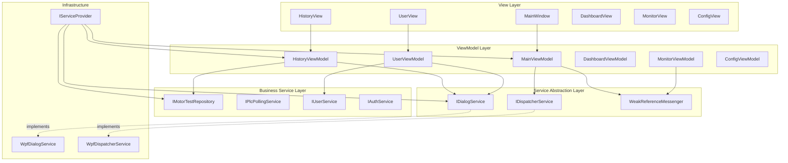

# 技术设计文档

## 概览

### 目标

将 MotorTestSystem 从当前存在严重架构问题的代码库重构为符合 MVVM 最佳实践的标准架构。核心目标包括:

1. **解除 ViewModel 到 View 的反向依赖** - ViewModel 不应直接创建或操作 View 类型
2. **替换 Service Locator 反模式** - 使用构造函数依赖注入替代 `BackendRuntime.Shared` 静态访问
3. **抽象 UI 框架依赖** - 创建 `IDialogService` 和 `IDispatcherService` 接口,使 ViewModel 可单元测试
4. **引入事件聚合器** - 使用 `WeakReferenceMessenger` 解耦 ViewModel 之间的通信
5. **清理数据模型** - 移除 Model 层的 UI 框架类型依赖

### 当前架构问题分析

**问题 1: ViewModel 直接依赖 View**

```csharp
// HistoryViewModel.cs - 直接创建 Window 实例
private void PrintMotorReport(MotorTestRecordModel record) {
    var reportWindow = new MotorReportWindow {
        DataContext = record,
        Owner = Application.Current.MainWindow  // 访问 UI 框架
    };
    reportWindow.ShowDialog();
}

// UserViewModel.cs - 直接创建对话框
private void AddUser() {
    var dialog = new UserEditWindow {
        DataContext = viewModel,
        Owner = Application.Current.MainWindow
    };
    if (dialog.ShowDialog() == true) { ... }
}
```

**影响**: ViewModel 无法在非 UI 环境中测试,违反 MVVM 分层原则


**问题 2: Service Locator 反模式**

```csharp
// 所有 ViewModel 构造函数中都存在
public HistoryViewModel() 
    : this(BackendRuntime.Shared.Repository) { }

public DashboardViewModel() 
    : this(BackendRuntime.Shared.Repository) { }

public MonitorViewModel() 
    : this(BackendRuntime.Shared) { }

// BackendRuntime 是静态单例,隐藏依赖关系
public sealed class BackendRuntime {
    public static BackendRuntime Shared { get; } = CreateDefault();
}
```

**影响**: 依赖关系不透明,无法替换依赖进行测试,违反依赖倒置原则

**问题 3: 直接访问 Application.Current.Dispatcher**

```csharp
// MainViewModel.cs
private void OnSnapshotReceived(object? sender, StationSnapshot snapshot) {
    var dispatcher = Application.Current?.Dispatcher;
    if (dispatcher == null || dispatcher.CheckAccess()) {
        ApplyOnlineState(snapshot);
    } else {
        dispatcher.InvokeAsync(() => ApplyOnlineState(snapshot));
    }
}

// MonitorViewModel.cs
private static void RunOnUiThread(Action action) {
    var dispatcher = Application.Current?.Dispatcher;
    if (dispatcher == null || dispatcher.CheckAccess()) {
        action();
    } else {
        dispatcher.InvokeAsync(action);
    }
}
```

**影响**: ViewModel 依赖 WPF Application 类型,无法在单元测试中同步执行


**问题 4: 数据模型混入 UI 类型**

```csharp
// DefectItem.cs
public class DefectItem : ObservableObject {
    private string _color = "#FFA500";
    
    public string Color {
        get => _color;
        set {
            SetProperty(ref _color, value);
            // 在模型中直接创建 Brush!
            ColorBrush = (Brush)new BrushConverter().ConvertFrom(_color);
        }
    }
    
    public Brush ColorBrush { get; private set; }  // UI 类型泄漏到模型层
}
```

**影响**: 模型层依赖 PresentationCore,无法在非 UI 环境中使用

**问题 5: ViewModel 之间强耦合**

```csharp
// MainViewModel.cs 直接访问 MonitorViewModel 的内部集合
public IEnumerable<StationState> GetAllStations() {
    return MonitorVM.NoLoadStations
        .Concat(MonitorVM.NoiseStations)
        .Concat(MonitorVM.LoadStations);
}
```

**影响**: 修改 MonitorViewModel 内部实现会破坏 MainViewModel

### 重构策略

采用 **分阶段增量重构** 策略,每个阶段保持系统可编译、可运行、可回滚:

- **P0 阶段 (立即修复)**: 解除 ViewModel-View 反向依赖,创建 IDialogService/IDispatcherService
- **P1 阶段 (短期优化)**: 手动依赖注入,引入事件聚合器,解耦 ViewModel
- **P2 阶段 (长期演进)**: 迁移到 DI 容器,移除 BackendRuntime

每个阶段在独立分支开发,合并前需通过完整回归测试。


## 架构设计

### 目标架构图



### 依赖流向原则

1. **View → ViewModel**: View 通过 DataContext 绑定 ViewModel
2. **ViewModel → Service Interface**: ViewModel 仅依赖抽象接口
3. **Service Implementation → Infrastructure**: 具体实现可访问 WPF 框架
4. **DI Container**: 负责创建整个对象图,注入依赖


## 组件和接口设计

### IDialogService 接口

**职责**: 封装所有 UI 对话框交互,使 ViewModel 可测试

**接口定义**:

```csharp
namespace MotorTestSystem.Services;

public interface IDialogService
{
    /// <summary>
    /// 显示消息框
    /// </summary>
    Task<MessageBoxResult> ShowMessageAsync(
        string message, 
        string title = "提示",
        MessageBoxButton button = MessageBoxButton.OK,
        MessageBoxImage icon = MessageBoxImage.Information);
    
    /// <summary>
    /// 显示保存文件对话框
    /// </summary>
    /// <returns>用户选择的文件路径,取消返回 null</returns>
    string? ShowSaveFileDialog(
        string filter = "CSV 文件|*.csv|所有文件|*.*",
        string defaultFileName = "export.csv");
    
    /// <summary>
    /// 显示打印对话框
    /// </summary>
    bool ShowPrintDialog(FlowDocument document);
    
    /// <summary>
    /// 显示电机报告窗口
    /// </summary>
    void ShowReportWindow(MotorTestRecordModel record);
    
    /// <summary>
    /// 显示用户编辑对话框
    /// </summary>
    /// <returns>编辑后的用户数据,取消返回 null</returns>
    UserEditResult? ShowUserEditDialog(
        string title,
        string account = "",
        string name = "",
        string role = "操作员",
        bool isEnabled = true);
    
    /// <summary>
    /// 设置剪贴板文本
    /// </summary>
    void SetClipboardText(string text);
}
```

**设计考量**:

- 所有方法均为同步或返回 Task,避免复杂的异步回调
- 不返回 Window 实例,只返回结果数据
- `ShowMessageAsync` 使用 Task 便于单元测试中模拟异步行为
- 参数使用 WPF 枚举类型 (MessageBoxButton 等) 是可接受的,因为这些是数据类型而非 UI 控件


### WpfDialogService 实现

**实现策略**:

```csharp
namespace MotorTestSystem.Services;

public class WpfDialogService : IDialogService
{
    private readonly IDispatcherService _dispatcher;
    
    public WpfDialogService(IDispatcherService dispatcher) {
        _dispatcher = dispatcher;
    }
    
    public Task<MessageBoxResult> ShowMessageAsync(
        string message, 
        string title = "提示",
        MessageBoxButton button = MessageBoxButton.OK,
        MessageBoxImage icon = MessageBoxImage.Information) 
    {
        // 确保在 UI 线程执行
        if (_dispatcher.CheckAccess()) {
            var result = MessageBox.Show(message, title, button, icon);
            return Task.FromResult(result);
        }
        
        return _dispatcher.InvokeAsync(() => 
            MessageBox.Show(message, title, button, icon));
    }
    
    public string? ShowSaveFileDialog(string filter, string defaultFileName) {
        return _dispatcher.Invoke(() => {
            var dialog = new SaveFileDialog {
                Filter = filter,
                FileName = defaultFileName
            };
            return dialog.ShowDialog() == true ? dialog.FileName : null;
        });
    }
    
    public bool ShowPrintDialog(FlowDocument document) {
        return _dispatcher.Invoke(() => {
            var printDialog = new PrintDialog();
            if (printDialog.ShowDialog() == true) {
                printDialog.PrintDocument(
                    ((IDocumentPaginatorSource)document).DocumentPaginator, 
                    "电机测试报告");
                return true;
            }
            return false;
        });
    }
    
    public void ShowReportWindow(MotorTestRecordModel record) {
        _dispatcher.Invoke(() => {
            var window = new MotorReportWindow {
                DataContext = record,
                Owner = Application.Current.MainWindow
            };
            window.ShowDialog();
        });
    }
    
    public UserEditResult? ShowUserEditDialog(
        string title, string account, string name, 
        string role, bool isEnabled) 
    {
        return _dispatcher.Invoke(() => {
            var vm = new UserEditDialogViewModel {
                Title = title,
                Account = account,
                Name = name,
                SelectedRole = role,
                IsEnabled = isEnabled
            };
            
            var dialog = new UserEditWindow {
                DataContext = vm,
                Owner = Application.Current.MainWindow
            };
            
            if (dialog.ShowDialog() == true) {
                return new UserEditResult(
                    vm.Account, vm.Name, vm.SelectedRole, vm.IsEnabled);
            }
            return null;
        });
    }
    
    public void SetClipboardText(string text) {
        _dispatcher.Invoke(() => Clipboard.SetText(text));
    }
}

// 返回值类型
public record UserEditResult(
    string Account, 
    string Name, 
    string Role, 
    bool IsEnabled);
```

**关键点**:

- 所有 WPF 控件创建都在 WpfDialogService 中,ViewModel 完全不接触
- 依赖 IDispatcherService 确保线程安全
- 使用 record 类型封装对话框返回数据


### IDispatcherService 接口

**职责**: 封装 UI 线程调度,使 ViewModel 可在单元测试中同步执行

**接口定义**:

```csharp
namespace MotorTestSystem.Services;

public interface IDispatcherService
{
    /// <summary>
    /// 在 UI 线程同步执行操作
    /// </summary>
    void Invoke(Action action);
    
    /// <summary>
    /// 在 UI 线程同步执行函数并返回结果
    /// </summary>
    TResult Invoke<TResult>(Func<TResult> func);
    
    /// <summary>
    /// 在 UI 线程异步执行操作
    /// </summary>
    Task InvokeAsync(Action action);
    
    /// <summary>
    /// 在 UI 线程异步执行函数并返回结果
    /// </summary>
    Task<TResult> InvokeAsync<TResult>(Func<TResult> func);
    
    /// <summary>
    /// 检查当前线程是否为 UI 线程
    /// </summary>
    bool CheckAccess();
}
```

### WpfDispatcherService 实现

```csharp
namespace MotorTestSystem.Services;

public class WpfDispatcherService : IDispatcherService
{
    private readonly Dispatcher _dispatcher;
    
    public WpfDispatcherService() {
        _dispatcher = Application.Current.Dispatcher;
    }
    
    public void Invoke(Action action) {
        if (_dispatcher.CheckAccess()) {
            action();
        } else {
            _dispatcher.Invoke(action);
        }
    }
    
    public TResult Invoke<TResult>(Func<TResult> func) {
        if (_dispatcher.CheckAccess()) {
            return func();
        }
        return _dispatcher.Invoke(func);
    }
    
    public Task InvokeAsync(Action action) {
        if (_dispatcher.CheckAccess()) {
            action();
            return Task.CompletedTask;
        }
        return _dispatcher.InvokeAsync(action).Task;
    }
    
    public Task<TResult> InvokeAsync<TResult>(Func<TResult> func) {
        if (_dispatcher.CheckAccess()) {
            return Task.FromResult(func());
        }
        return _dispatcher.InvokeAsync(func).Task;
    }
    
    public bool CheckAccess() => _dispatcher.CheckAccess();
}
```


### 测试用 Mock 实现

```csharp
// 单元测试中使用的同步实现
public class SyncDispatcherService : IDispatcherService
{
    public void Invoke(Action action) => action();
    
    public TResult Invoke<TResult>(Func<TResult> func) => func();
    
    public Task InvokeAsync(Action action) {
        action();
        return Task.CompletedTask;
    }
    
    public Task<TResult> InvokeAsync<TResult>(Func<TResult> func) 
        => Task.FromResult(func());
    
    public bool CheckAccess() => true;  // 测试中总是返回 true
}

// 单元测试中使用的对话框 Mock
public class MockDialogService : IDialogService
{
    public MessageBoxResult NextMessageBoxResult { get; set; } = MessageBoxResult.OK;
    public string? NextSaveFilePath { get; set; }
    public UserEditResult? NextUserEditResult { get; set; }
    
    public List<string> ShownMessages { get; } = new();
    
    public Task<MessageBoxResult> ShowMessageAsync(
        string message, string title, 
        MessageBoxButton button, MessageBoxImage icon) 
    {
        ShownMessages.Add(message);
        return Task.FromResult(NextMessageBoxResult);
    }
    
    public string? ShowSaveFileDialog(string filter, string defaultFileName) 
        => NextSaveFilePath;
    
    public bool ShowPrintDialog(FlowDocument document) => true;
    
    public void ShowReportWindow(MotorTestRecordModel record) { }
    
    public UserEditResult? ShowUserEditDialog(
        string title, string account, string name, 
        string role, bool isEnabled) 
        => NextUserEditResult;
    
    public void SetClipboardText(string text) { }
}
```


### 事件聚合器设计

**使用 CommunityToolkit.Mvvm.Messaging.WeakReferenceMessenger**

**消息定义**:

```csharp
namespace MotorTestSystem.Messages;

/// <summary>
/// 工站快照消息 - PlcPollingService 发布
/// </summary>
public record StationSnapshotMessage(StationSnapshot Snapshot);

/// <summary>
/// PLC 日志消息 - PlcPollingService 发布
/// </summary>
public record PlcLogMessage(string Message);

/// <summary>
/// 用户状态变更消息 - AuthService 发布
/// </summary>
public record UserStatusChangedMessage(string UserName, string Role);
```

**发布端改造 (PlcPollingService)**:

```csharp
public class PlcPollingService
{
    private readonly IMessenger _messenger;
    
    // 保留现有事件用于向后兼容 (P0/P1 阶段)
    public event EventHandler<StationSnapshot>? SnapshotReceived;
    public event EventHandler<string>? LogReceived;
    
    public PlcPollingService(
        ObservableCollection<StationConfig> configs,
        IMotorTestRepository repository,
        IPlcClientFactory clientFactory,
        IMessenger? messenger)  // P0 阶段可为 null
    {
        _messenger = messenger ?? WeakReferenceMessenger.Default;
        // ...
    }
    
    private void HandleSnapshot(StationSnapshot snapshot) {
        // 发送传统事件
        SnapshotReceived?.Invoke(this, snapshot);
        
        // 发送消息
        _messenger.Send(new StationSnapshotMessage(snapshot));
    }
    
    private void HandleLog(string message) {
        LogReceived?.Invoke(this, message);
        _messenger.Send(new PlcLogMessage(message));
    }
}
```


**订阅端改造 (MainViewModel)**:

```csharp
public class MainViewModel : ViewModelBase
{
    private readonly IDispatcherService _dispatcher;
    private readonly IMessenger _messenger;
    
    public MainViewModel(
        DashboardViewModel dashboardVM,
        MonitorViewModel monitorVM,
        HistoryViewModel historyVM,
        ConfigViewModel configVM,
        UserViewModel userVM,
        IDispatcherService dispatcher,
        IMessenger messenger)
    {
        _dispatcher = dispatcher;
        _messenger = messenger;
        
        DashboardVM = dashboardVM;
        MonitorVM = monitorVM;
        HistoryVM = historyVM;
        ConfigVM = configVM;
        UserVM = userVM;
        
        // 订阅消息
        _messenger.Register<StationSnapshotMessage>(this, OnSnapshotMessage);
        
        _currentView = DashboardVM;
        StartClock();
    }
    
    private void OnSnapshotMessage(object recipient, StationSnapshotMessage msg) {
        _dispatcher.InvokeAsync(() => ApplyOnlineState(msg.Snapshot));
    }
    
    private void ApplyOnlineState(StationSnapshot snapshot) {
        _onlineStations[snapshot.StationId] = snapshot.IsOnline;
        OnlineStationCount = _onlineStations.Count(kvp => kvp.Value);
    }
    
    // 析构时自动取消订阅 (WeakReference 机制)
}
```

**订阅端改造 (MonitorViewModel)**:

```csharp
public class MonitorViewModel : ViewModelBase
{
    private readonly IDispatcherService _dispatcher;
    private readonly IMessenger _messenger;
    
    public MonitorViewModel(
        ObservableCollection<StationConfig> stationConfigs,
        IDispatcherService dispatcher,
        IMessenger messenger)
    {
        _dispatcher = dispatcher;
        _messenger = messenger;
        
        BuildStationStates(stationConfigs);
        
        _messenger.Register<StationSnapshotMessage>(this, OnSnapshotMessage);
        _messenger.Register<PlcLogMessage>(this, OnLogMessage);
    }
    
    private void OnSnapshotMessage(object recipient, StationSnapshotMessage msg) {
        _dispatcher.InvokeAsync(() => ApplySnapshot(msg.Snapshot));
    }
    
    private void OnLogMessage(object recipient, PlcLogMessage msg) {
        _dispatcher.InvokeAsync(() => {
            SystemLogs.Insert(0, $"{DateTime.Now:HH:mm:ss} {msg.Message}");
            while (SystemLogs.Count > 10) {
                SystemLogs.RemoveAt(SystemLogs.Count - 1);
            }
        });
    }
}
```


### ViewModel 构造函数改造

**HistoryViewModel 改造前后对比**:

```csharp
// 改造前
public class HistoryViewModel : ViewModelBase
{
    private readonly IMotorTestRepository _repository;
    
    public HistoryViewModel() 
        : this(BackendRuntime.Shared.Repository) { }
    
    public HistoryViewModel(IMotorTestRepository repository) {
        _repository = repository;
        LoadMockData();
    }
    
    [RelayCommand]
    private void Export() {
        var path = Path.Combine(
            Environment.GetFolderPath(Environment.SpecialFolder.Desktop),
            "电机电性能测试数据导出.csv");
        // ... 直接写文件,无法测试
    }
}

// 改造后
public class HistoryViewModel : ViewModelBase
{
    private readonly IMotorTestRepository _repository;
    private readonly IDialogService _dialogService;
    
    // 移除无参构造函数,强制依赖注入
    public HistoryViewModel(
        IMotorTestRepository repository,
        IDialogService dialogService)
    {
        _repository = repository;
        _dialogService = dialogService;
        LoadMockData();
    }
    
    [RelayCommand]
    private void Export() {
        var path = _dialogService.ShowSaveFileDialog(
            "CSV 文件|*.csv|所有文件|*.*",
            "电机电性能测试数据导出.csv");
        
        if (path == null) return;  // 用户取消
        
        try {
            WriteCSV(path);
            _dialogService.ShowMessageAsync(
                $"成功导出 {TestResults.Count} 条记录至:\n{path}",
                "数据导出成功",
                MessageBoxButton.OK,
                MessageBoxImage.Information);
        } catch (Exception ex) {
            _dialogService.ShowMessageAsync(
                "导出数据失败: " + ex.Message,
                "导出错误",
                MessageBoxButton.OK,
                MessageBoxImage.Error);
        }
    }
}
```


**UserViewModel 改造前后对比**:

```csharp
// 改造前
[RelayCommand]
private void AddUser() {
    var vm = new UserEditDialogViewModel {
        Title = "新增用户",
        IsEnabled = true
    };
    
    var dialog = new UserEditWindow {
        DataContext = vm,
        Owner = Application.Current.MainWindow  // 依赖 WPF
    };
    
    if (dialog.ShowDialog() == true) {
        var item = new UserItem {
            Account = vm.Account,
            Name = vm.Name,
            Role = vm.SelectedRole,
            Status = vm.IsEnabled ? "在线" : "禁用",
            LastLoginTime = "-"
        };
        _allUsers.Insert(0, item);
        FilterUsers();
    }
}

// 改造后
public class UserViewModel : ViewModelBase
{
    private readonly IDialogService _dialogService;
    
    public UserViewModel(IDialogService dialogService) {
        _dialogService = dialogService;
        LoadMockUsers();
        FilterUsers();
    }
    
    [RelayCommand]
    private void AddUser() {
        var result = _dialogService.ShowUserEditDialog(
            title: "新增用户",
            account: "",
            name: "",
            role: "操作员",
            isEnabled: true);
        
        if (result == null) return;  // 用户取消
        
        var item = new UserItem {
            Account = result.Account,
            Name = result.Name,
            Role = result.Role,
            Status = result.IsEnabled ? "在线" : "禁用",
            LastLoginTime = "-"
        };
        _allUsers.Insert(0, item);
        FilterUsers();
    }
}
```


## 数据模型设计

### DefectItem 重构

**问题**: 当前在数据模型中直接创建 Brush 对象

```csharp
// 重构前
public class DefectItem : ObservableObject
{
    private string _color = "#FFA500";
    
    public string Color {
        get => _color;
        set {
            SetProperty(ref _color, value);
            ColorBrush = (Brush)new BrushConverter().ConvertFrom(_color);
        }
    }
    
    public Brush ColorBrush { get; private set; }  // 依赖 PresentationCore
}
```

**重构后**: 移除 UI 类型,使用 IValueConverter 在 XAML 中转换

```csharp
// DefectItem.cs - 纯数据模型
public class DefectItem : ObservableObject
{
    private string _name = string.Empty;
    private double _percentage;
    private string _color = "#FFA500";  // 存储颜色字符串
    
    public string Name {
        get => _name;
        set => SetProperty(ref _name, value);
    }
    
    public double Percentage {
        get => _percentage;
        set => SetProperty(ref _percentage, value);
    }
    
    public string Color {
        get => _color;
        set => SetProperty(ref _color, value);
    }
}

// StringToColorBrushConverter.cs - 转换器
public class StringToColorBrushConverter : IValueConverter
{
    public object Convert(object value, Type targetType, 
        object parameter, CultureInfo culture)
    {
        if (value is string colorStr && !string.IsNullOrEmpty(colorStr)) {
            return new BrushConverter().ConvertFrom(colorStr) 
                ?? Brushes.Gray;
        }
        return Brushes.Gray;
    }
    
    public object ConvertBack(object value, Type targetType, 
        object parameter, CultureInfo culture)
    {
        throw new NotImplementedException();
    }
}
```


**XAML 使用**:

```xml
<UserControl.Resources>
    <converters:StringToColorBrushConverter x:Key="ColorConverter"/>
</UserControl.Resources>

<!-- 重构前 -->
<Rectangle Fill="{Binding ColorBrush}" Width="12" Height="12"/>

<!-- 重构后 -->
<Rectangle Fill="{Binding Color, Converter={StaticResource ColorConverter}}" 
           Width="12" Height="12"/>
```

### FaultReason 重构

类似处理,移除 UI 依赖:

```csharp
// 重构后
public class FaultReason : ObservableObject
{
    public string Rank { get; set; } = string.Empty;
    public string Name { get; set; } = string.Empty;
    public int Count { get; set; }
    public string Color { get; set; } = "#8E9AA7";  // 纯字符串
}
```

XAML 中使用相同的 `StringToColorBrushConverter`。


## 错误处理

### 对话框服务异常处理

```csharp
public class WpfDialogService : IDialogService
{
    public string? ShowSaveFileDialog(string filter, string defaultFileName) {
        try {
            return _dispatcher.Invoke(() => {
                var dialog = new SaveFileDialog {
                    Filter = filter,
                    FileName = defaultFileName
                };
                return dialog.ShowDialog() == true ? dialog.FileName : null;
            });
        } catch (Exception ex) {
            // 记录日志但不抛出,返回 null 表示失败
            Debug.WriteLine($"ShowSaveFileDialog failed: {ex.Message}");
            return null;
        }
    }
}
```

### ViewModel 异常处理

```csharp
[RelayCommand]
private async void Export() {
    var path = _dialogService.ShowSaveFileDialog(
        "CSV 文件|*.csv|所有文件|*.*",
        "电机电性能测试数据导出.csv");
    
    if (path == null) return;
    
    try {
        await WriteCSVAsync(path);
        await _dialogService.ShowMessageAsync(
            $"成功导出 {TestResults.Count} 条记录",
            "导出成功");
    } catch (IOException ex) {
        await _dialogService.ShowMessageAsync(
            $"文件写入失败: {ex.Message}\n请确保文件未被占用",
            "导出失败",
            MessageBoxButton.OK,
            MessageBoxImage.Error);
    } catch (Exception ex) {
        await _dialogService.ShowMessageAsync(
            $"导出失败: {ex.Message}",
            "导出失败",
            MessageBoxButton.OK,
            MessageBoxImage.Error);
    }
}
```

### 消息订阅异常隔离

```csharp
private void OnSnapshotMessage(object recipient, StationSnapshotMessage msg) {
    try {
        _dispatcher.InvokeAsync(() => ApplyOnlineState(msg.Snapshot));
    } catch (Exception ex) {
        // 防止单个订阅者异常影响其他订阅者
        Debug.WriteLine($"OnSnapshotMessage failed: {ex}");
    }
}
```


## 测试策略

### 单元测试能力验证

重构后,所有 ViewModel 都可以进行单元测试:

```csharp
// HistoryViewModel.Tests.cs
public class HistoryViewModelTests
{
    [Fact]
    public void Export_UserCancels_DoesNotCallRepository()
    {
        // Arrange
        var mockRepo = new Mock<IMotorTestRepository>();
        var mockDialog = new MockDialogService {
            NextSaveFilePath = null  // 模拟用户取消
        };
        var vm = new HistoryViewModel(mockRepo.Object, mockDialog);
        
        // Act
        vm.ExportCommand.Execute(null);
        
        // Assert
        Assert.Empty(mockDialog.ShownMessages);
        mockRepo.Verify(r => r.ExportAsync(It.IsAny<string>()), Times.Never);
    }
    
    [Fact]
    public async Task Export_Success_ShowsSuccessMessage()
    {
        // Arrange
        var mockRepo = new Mock<IMotorTestRepository>();
        var mockDialog = new MockDialogService {
            NextSaveFilePath = "test.csv"
        };
        var vm = new HistoryViewModel(mockRepo.Object, mockDialog);
        
        // Act
        vm.ExportCommand.Execute(null);
        await Task.Delay(100);  // 等待异步完成
        
        // Assert
        Assert.Contains("成功导出", mockDialog.ShownMessages[0]);
    }
}

// UserViewModel.Tests.cs
public class UserViewModelTests
{
    [Fact]
    public void AddUser_UserConfirms_AddsToCollection()
    {
        // Arrange
        var mockDialog = new MockDialogService {
            NextUserEditResult = new UserEditResult(
                "OP-10999", "测试用户", "操作员", true)
        };
        var vm = new UserViewModel(mockDialog);
        var initialCount = vm.Users.Count;
        
        // Act
        vm.AddUserCommand.Execute(null);
        
        // Assert
        Assert.Equal(initialCount + 1, vm.Users.Count);
        Assert.Contains(vm.Users, u => u.Account == "OP-10999");
    }
}
```


### 集成测试

```csharp
// MainViewModel.IntegrationTests.cs
public class MainViewModelIntegrationTests
{
    [Fact]
    public void SnapshotMessage_UpdatesOnlineStationCount()
    {
        // Arrange
        var messenger = WeakReferenceMessenger.Default;
        var dispatcher = new SyncDispatcherService();
        var vm = CreateMainViewModel(dispatcher, messenger);
        
        // Act
        messenger.Send(new StationSnapshotMessage(
            new StationSnapshot {
                StationId = "A1",
                IsOnline = true
            }));
        
        // Assert - 同步执行,立即生效
        Assert.Equal(1, vm.OnlineStationCount);
    }
}
```

### 测试覆盖率目标

- **ViewModel 层**: 60% 以上代码覆盖率
- **Service 接口层**: 80% 以上代码覆盖率
- **关键命令**: 100% 覆盖 (AddUser, EditUser, Export, Print 等)

### 回归测试清单

在每个重构阶段完成后,执行以下手动测试:

**P0 阶段回归测试**:
- [ ] 历史记录导出 CSV 功能正常
- [ ] 历史记录打印功能正常
- [ ] 用户新增/编辑对话框正常显示
- [ ] 用户密码重置消息框正常显示
- [ ] Dashboard 缺陷列表颜色正常显示

**P1 阶段回归测试**:
- [ ] PLC 快照更新实时反映在 Dashboard
- [ ] PLC 快照更新实时反映在 Monitor
- [ ] 在线工站数量统计正确
- [ ] Monitor 日志列表实时更新
- [ ] 所有 ViewModel 可通过构造函数创建

**P2 阶段回归测试**:
- [ ] 应用启动正常,所有服务自动注入
- [ ] 无 BackendRuntime.Shared 静态访问
- [ ] MainWindow 通过 IServiceProvider 解析 ViewModel
- [ ] 所有功能与 P0/P1 一致


## 分阶段实施计划

### P0 阶段: 立即修复 (1-2 天)

**目标**: 解除 ViewModel 到 View 的反向依赖,创建抽象接口

**Git 分支**: `refactor/p0-view-decoupling`

**实施步骤**:

1. **创建服务接口** (0.5 天)
   - 创建 `IDialogService` 接口及方法签名
   - 创建 `IDispatcherService` 接口及方法签名
   - 创建 `WpfDialogService` 实现类
   - 创建 `WpfDispatcherService` 实现类
   - 创建测试用 `MockDialogService` 和 `SyncDispatcherService`

2. **重构数据模型** (0.5 天)
   - 移除 `DefectItem.ColorBrush` 属性
   - 移除 `FaultReason.ColorBrush` 属性
   - 创建 `StringToColorBrushConverter`
   - 更新 `DashboardView.xaml` 绑定

3. **重构 HistoryViewModel** (0.5 天)
   - 添加 `IDialogService` 构造函数参数
   - 重写 `Export()` 方法使用 `ShowSaveFileDialog`
   - 重写 `PrintMotorReport()` 方法使用 `ShowPrintDialog`
   - 更新所有 `MessageBox.Show` 为 `ShowMessageAsync`
   - 保留无参构造函数调用 `BackendRuntime.Shared` (向后兼容)

4. **重构 UserViewModel** (0.5 天)
   - 添加 `IDialogService` 构造函数参数
   - 重写 `AddUser()` 使用 `ShowUserEditDialog`
   - 重写 `EditUser()` 使用 `ShowUserEditDialog`
   - 重写 `ResetPassword()` 使用 `ShowMessageAsync`
   - 保留无参构造函数 (向后兼容)

**验收标准**:
- HistoryViewModel 编译时不引用 `MotorTestSystem.Views` 命名空间
- UserViewModel 编译时不引用 `MotorTestSystem.Views` 命名空间
- 所有对话框功能手动测试通过
- 可以编写 ViewModel 单元测试

**风险**: 无,向后兼容性保持


### P1 阶段: 短期优化 (2-3 天)

**目标**: 手动依赖注入,引入事件聚合器,抽象线程调度

**Git 分支**: `refactor/p1-di-messaging`

**实施步骤**:

1. **引入 WeakReferenceMessenger** (0.5 天)
   - 创建 `Messages` 命名空间
   - 定义 `StationSnapshotMessage` 记录类型
   - 定义 `PlcLogMessage` 记录类型
   - 修改 `PlcPollingService` 同时发送事件和消息 (向后兼容)

2. **重构 MainViewModel** (1 天)
   - 移除无参构造函数
   - 添加所有依赖到构造函数:
     - `DashboardViewModel dashboardVM`
     - `MonitorViewModel monitorVM`
     - `HistoryViewModel historyVM`
     - `ConfigViewModel configVM`
     - `UserViewModel userVM`
     - `IDispatcherService dispatcher`
     - `IMessenger messenger`
   - 订阅 `StationSnapshotMessage` 替代直接事件订阅
   - 移除 `Application.Current.Dispatcher` 访问,使用 `IDispatcherService`
   - 移除 `BackendRuntime` 依赖

3. **重构 MonitorViewModel** (1 天)
   - 移除无参构造函数
   - 添加依赖到构造函数:
     - `ObservableCollection<StationConfig> stationConfigs`
     - `IDispatcherService dispatcher`
     - `IMessenger messenger`
   - 订阅 `StationSnapshotMessage` 和 `PlcLogMessage`
   - 移除 `Application.Current.Dispatcher` 访问
   - 添加 `AllStations` 属性供 MainViewModel 使用
   - 移除 `BackendRuntime` 依赖

4. **重构 DashboardViewModel** (0.5 天)
   - 添加 `IDispatcherService` 到构造函数
   - 移除定时器中的 `GetAwaiter().GetResult()` 阻塞调用
   - 改为 `async` 定时器回调

5. **重构 ConfigViewModel** (0.5 天)
   - 添加 `IDialogService` 到构造函数
   - 重写 `TestConnectionAsync` 和 `SaveAll` 使用对话框服务

**验收标准**:
- 所有 ViewModel 都有明确的构造函数依赖
- 没有 `Application.Current.Dispatcher` 访问
- PLC 消息通过 Messenger 传递
- 可以对所有 ViewModel 进行单元测试

**风险**: 中等 - 需要在 MainWindow 中手动构造依赖图


### P2 阶段: 长期演进 (2-3 天)

**目标**: 迁移到 DI 容器,彻底移除 BackendRuntime

**Git 分支**: `refactor/p2-di-container`

**实施步骤**:

1. **引入 DI 容器** (0.5 天)
   - 添加 `Microsoft.Extensions.DependencyInjection` NuGet 包
   - 在 `App.xaml.cs` 创建 `IServiceCollection`
   - 创建 `ServiceCollectionExtensions` 类封装注册逻辑

2. **注册所有服务** (1 天)
   ```csharp
   public static class ServiceCollectionExtensions
   {
       public static IServiceCollection AddMotorTestSystemServices(
           this IServiceCollection services)
       {
           // 基础设施服务
           services.AddSingleton<IDialogService, WpfDialogService>();
           services.AddSingleton<IDispatcherService, WpfDispatcherService>();
           services.AddSingleton<IMessenger>(WeakReferenceMessenger.Default);
           
           // 数据访问服务
           services.AddSingleton<IMotorTestRepository, InMemoryMotorTestRepository>();
           services.AddSingleton<IUserService, MockUserService>();
           
           // 业务服务
           services.AddSingleton<IPlcClientFactory, MockPlcClientFactory>();
           services.AddSingleton<IAuthService, AuthService>();
           
           // 初始化 StationConfigs
           services.AddSingleton(sp => CreateDefaultStationConfigs());
           
           // PlcPollingService 需要特殊处理
           services.AddSingleton<PlcPollingService>(sp => {
               var configs = sp.GetRequiredService<ObservableCollection<StationConfig>>();
               var repo = sp.GetRequiredService<IMotorTestRepository>();
               var factory = sp.GetRequiredService<IPlcClientFactory>();
               var messenger = sp.GetRequiredService<IMessenger>();
               var service = new PlcPollingService(configs, repo, factory, messenger);
               service.Start();  // 自动启动
               return service;
           });
           
           // 注册所有 ViewModel
           services.AddSingleton<DashboardViewModel>();
           services.AddSingleton<MonitorViewModel>();
           services.AddSingleton<HistoryViewModel>();
           services.AddSingleton<ConfigViewModel>();
           services.AddSingleton<UserViewModel>();
           services.AddSingleton<MainViewModel>();
           
           return services;
       }
   }
   ```


3. **修改 App.xaml.cs** (0.5 天)
   ```csharp
   public partial class App : Application
   {
       private IServiceProvider? _serviceProvider;
       
       protected override void OnStartup(StartupEventArgs e)
       {
           base.OnStartup(e);
           
           // 构建 DI 容器
           var services = new ServiceCollection();
           services.AddMotorTestSystemServices();
           _serviceProvider = services.BuildServiceProvider();
           
           // 显示登录窗口
           var loginWindow = new LoginWindow();
           if (loginWindow.ShowDialog() == true) {
               // 解析 MainViewModel
               var mainVM = _serviceProvider.GetRequiredService<MainViewModel>();
               var mainWindow = new MainWindow {
                   DataContext = mainVM
               };
               mainWindow.Show();
           } else {
               Shutdown();
           }
       }
       
       protected override void OnExit(ExitEventArgs e)
       {
           // 释放资源
           if (_serviceProvider is IDisposable disposable) {
               disposable.Dispose();
           }
           base.OnExit(e);
       }
   }
   ```

4. **移除 BackendRuntime** (0.5 天)
   - 删除 `BackendRuntime.Shared` 静态属性
   - 删除 `BackendRuntime.CreateDefault()` 方法
   - 移除所有 ViewModel 中的 `BackendRuntime` 引用
   - 确保所有依赖都通过构造函数注入

5. **更新 MainWindow** (0.5 天)
   ```csharp
   public partial class MainWindow : Window
   {
       public MainWindow()
       {
           InitializeComponent();
           // DataContext 由 App.xaml.cs 设置
       }
   }
   ```

**验收标准**:
- 应用启动时自动构建依赖图
- 无 `BackendRuntime.Shared` 静态访问
- 所有服务通过 DI 容器解析
- 完整回归测试通过

**风险**: 高 - 影响应用启动流程,需要完整测试


### 回滚策略

每个阶段在独立分支开发,合并前需要评审和测试:

```bash
# P0 阶段
git checkout -b refactor/p0-view-decoupling
# ... 开发和测试 ...
git checkout main
git merge refactor/p0-view-decoupling

# 如果 P0 出现问题,回滚
git revert -m 1 <merge-commit-hash>

# P1 阶段基于 P0
git checkout -b refactor/p1-di-messaging
# ... 开发和测试 ...
git checkout main
git merge refactor/p1-di-messaging

# P2 阶段基于 P1
git checkout -b refactor/p2-di-container
# ... 开发和测试 ...
git checkout main
git merge refactor/p2-di-container
```

**兼容性保证**:

- **P0 阶段**: 保留所有无参构造函数,旧代码仍可运行
- **P1 阶段**: 提供适配层,MainWindow 手动构造依赖
- **P2 阶段**: 完全迁移,不保证向后兼容

### 验证清单

每个阶段完成后,执行以下验证:

**编译验证**:
- [ ] 解决方案编译成功,无警告
- [ ] 所有 ViewModel 项目不引用 View 项目
- [ ] 所有 Model 项目不引用 PresentationCore

**功能验证**:
- [ ] 登录流程正常
- [ ] 所有 Tab 切换正常
- [ ] Dashboard 实时数据更新正常
- [ ] Monitor 工站状态更新正常
- [ ] History 查询/导出/打印功能正常
- [ ] User 增删改功能正常
- [ ] Config 连接测试功能正常

**性能验证**:
- [ ] 应用启动时间 < 3 秒
- [ ] PLC 快照处理延迟 < 100ms
- [ ] UI 响应流畅,无卡顿

**测试验证**:
- [ ] 至少 5 个 ViewModel 单元测试通过
- [ ] 代码覆盖率 > 60%


## 测试策略 (补充)

### 为什么不使用 Property-Based Testing

本项目是架构重构而非新功能开发,重构的核心目标是 **改变代码结构而不改变行为**。基于以下原因,不采用 property-based testing:

1. **需求类型不匹配**: 大部分需求是静态代码约束 (不引用特定命名空间、构造函数签名等),而非运行时行为属性
2. **缺少纯函数逻辑**: 重构涉及的是依赖注入、接口抽象等基础设施变更,没有明显的输入输出转换逻辑
3. **重点是等价性**: 需要验证重构前后行为完全一致,而非发现边界情况
4. **配置密集**: DI 容器配置类似 IaC,更适合快照测试和集成测试

### 测试策略组合

1. **静态分析测试** (编译时)
   - 使用 Roslyn 分析器验证命名空间依赖
   - 使用反射验证接口签名和构造函数参数
   - 示例测试:
     ```csharp
     [Fact]
     public void HistoryViewModel_ShouldNotReferenceViewsNamespace() {
         var assembly = typeof(HistoryViewModel).Assembly;
         var type = typeof(HistoryViewModel);
         var references = type.GetReferencedTypes();
         Assert.DoesNotContain(references, 
             t => t.Namespace?.StartsWith("MotorTestSystem.Views") == true);
     }
     ```

2. **单元测试** (Mock-based)
   - 使用 Moq/NSubstitute mock 所有依赖
   - 验证 ViewModel 调用了正确的服务方法
   - 验证命令执行逻辑正确
   - 目标覆盖率: 60%+ ViewModel 代码


3. **集成测试**
   - 测试 WpfDialogService 在实际 WPF 环境中的行为
   - 测试 WeakReferenceMessenger 消息传递
   - 测试 DI 容器能正确解析所有服务
   - 示例:
     ```csharp
     [WpfFact]  // xUnit.Wpf
     public void WpfDialogService_ShowMessageAsync_DisplaysMessageBox() {
         var dispatcher = new WpfDispatcherService();
         var service = new WpfDialogService(dispatcher);
         
         var result = service.ShowMessageAsync("测试消息", "测试标题").Result;
         
         Assert.Equal(MessageBoxResult.OK, result);
     }
     ```

4. **快照测试**
   - 保存 DI 容器配置快照
   - 保存 ViewModel 依赖图快照
   - 重构后对比,确保依赖关系一致

5. **回归测试** (手动)
   - 每个阶段完成后执行完整功能测试清单
   - 使用 Checklist 确保所有功能可用
   - 性能基准测试 (启动时间、UI 响应时间)

### 测试工具链

```xml
<!-- 测试项目 NuGet 包 -->
<PackageReference Include="xunit" Version="2.6.0" />
<PackageReference Include="xunit.runner.visualstudio" Version="2.5.0" />
<PackageReference Include="Moq" Version="4.20.0" />
<PackageReference Include="FluentAssertions" Version="6.12.0" />
<PackageReference Include="Xunit.StaFact" Version="1.1.11" />  <!-- WPF 测试 -->
<PackageReference Include="coverlet.collector" Version="6.0.0" />
```

### 示例单元测试

```csharp
public class HistoryViewModelTests
{
    [Fact]
    public void Constructor_InjectsDependencies_Succeeds() {
        // Arrange
        var mockRepo = new Mock<IMotorTestRepository>();
        var mockDialog = new MockDialogService();
        
        // Act
        var vm = new HistoryViewModel(mockRepo.Object, mockDialog);
        
        // Assert
        Assert.NotNull(vm);
        Assert.NotEmpty(vm.TestResults);
    }
    
    [Fact]
    public void ExportCommand_UserCancels_DoesNotShowSuccessMessage() {
        // Arrange
        var mockRepo = new Mock<IMotorTestRepository>();
        var mockDialog = new MockDialogService {
            NextSaveFilePath = null  // 模拟取消
        };
        var vm = new HistoryViewModel(mockRepo.Object, mockDialog);
        
        // Act
        vm.ExportCommand.Execute(null);
        
        // Assert
        Assert.Empty(mockDialog.ShownMessages);
    }
    
    [Fact]
    public void ExportCommand_Success_ShowsSuccessMessage() {
        // Arrange
        var mockRepo = new Mock<IMotorTestRepository>();
        var mockDialog = new MockDialogService {
            NextSaveFilePath = "test.csv"
        };
        var vm = new HistoryViewModel(mockRepo.Object, mockDialog);
        
        // Act
        vm.ExportCommand.Execute(null);
        
        // Assert
        Assert.Single(mockDialog.ShownMessages);
        Assert.Contains("成功导出", mockDialog.ShownMessages[0]);
    }
}
```


## 风险与缓解措施

### 技术风险

| 风险 | 严重性 | 缓解措施 |
|------|--------|----------|
| WpfDialogService 线程安全问题 | 中 | 所有方法内部通过 IDispatcherService 确保 UI 线程执行 |
| WeakReferenceMessenger 内存泄漏 | 中 | 使用 WeakReference 机制,ViewModel 析构自动取消订阅;增加内存泄漏测试 |
| DI 容器循环依赖 | 高 | 设计阶段明确依赖方向,避免双向依赖;使用工厂模式打破循环 |
| PlcPollingService 启动时机问题 | 中 | 在 DI 容器注册时延迟启动,确保所有依赖就绪后再启动 |
| ViewModel 构造函数参数过多 | 低 | P2 阶段通过 DI 容器自动解析,开发者不手动构造 |

### 业务风险

| 风险 | 严重性 | 缓解措施 |
|------|--------|----------|
| 重构引入功能回归 | 高 | 每个阶段完成后执行完整回归测试清单;保留 Git 分支便于回滚 |
| 性能下降 | 中 | 基准测试对比重构前后性能;优化 IDispatcherService 减少线程切换 |
| 测试覆盖率不足 | 中 | 设定 60% 覆盖率目标;优先测试关键命令 |
| 团队学习曲线 | 低 | 提供设计文档和示例代码;代码评审确保理解 |

### 时间风险

| 风险 | 严重性 | 缓解措施 |
|------|--------|----------|
| P0 阶段超期 | 低 | 预留 0.5 天 buffer;优先完成 HistoryViewModel 和 UserViewModel |
| P1 阶段超期 | 中 | 预留 1 天 buffer;如超期可推迟 ConfigViewModel 重构到 P2 |
| P2 阶段超期 | 中 | 预留 1 天 buffer;如超期可分拆为两个子阶段合并 |
| 回归测试时间不足 | 高 | 提前准备测试清单;自动化部分回归测试 |

### 回滚决策树

```
重构阶段完成
    ↓
执行回归测试
    ↓
  [通过?]
   ↙   ↘
 是      否
 ↓       ↓
合并   [可快速修复?]
到主   ↙        ↘
分支  是          否
     ↓            ↓
   修复并      回滚到
   重新测试    上一阶段
     ↓            ↓
   合并        记录问题
              重新设计
```

**回滚触发条件**:
- 关键功能无法使用 (登录、数据查询、设备通信)
- 性能下降 > 30%
- 出现严重内存泄漏
- 无法在 2 个工作日内修复


## 技术债务与未来改进

### 当前设计的权衡

1. **保留部分事件机制 (P0/P1)**
   - **权衡**: PlcPollingService 同时发送 C# 事件和 Messenger 消息
   - **原因**: 保证向后兼容,降低迁移风险
   - **未来**: P3 阶段完全移除 C# 事件,统一使用 Messenger

2. **MainWindow 仍在 View 层创建**
   - **权衡**: MainWindow 由 App.xaml.cs 创建而非 DI 容器
   - **原因**: WPF 启动流程限制
   - **未来**: 考虑使用 MVVM 框架 (Prism/Caliburn.Micro) 简化

3. **IDialogService 返回 WPF 枚举类型**
   - **权衡**: `ShowMessageAsync` 返回 `MessageBoxResult`
   - **原因**: 避免定义重复的枚举类型
   - **未来**: 如需跨平台,定义平台无关的枚举

4. **InMemoryMotorTestRepository 作为默认实现**
   - **权衡**: P2 阶段仍使用内存仓储而非真实数据库
   - **原因**: 重构焦点是架构而非数据层
   - **未来**: P4 阶段迁移到 SqlSugarMotorTestRepository

### 长期改进方向

#### P3 阶段: 完善测试和监控 (可选)

- 增加端到端自动化测试 (使用 FlaUI)
- 集成 Application Insights 遥测
- 增加性能计数器和 APM
- 实现配置热重载

#### P4 阶段: 数据层重构 (可选)

- 迁移到真实数据库 (SQL Server/PostgreSQL)
- 实现 Repository Pattern 完整版
- 增加 Unit of Work 模式
- 支持数据库迁移 (EF Core Migrations)

#### P5 阶段: 现代化升级 (可选)

- 升级到 .NET 8 或更高版本
- 使用 Source Generators 减少反射
- 引入 Reactive Extensions (Rx.NET)
- 考虑 MAUI 跨平台迁移

### 文档维护

重构完成后,需要更新以下文档:

- [ ] 架构设计文档 (添加 MVVM 架构图)
- [ ] 开发者指南 (依赖注入使用说明)
- [ ] 测试指南 (单元测试编写规范)
- [ ] 部署指南 (DI 容器配置说明)
- [ ] API 文档 (IDialogService/IDispatcherService 接口)


## 总结

### 核心成果

通过本次重构,MotorTestSystem 将从存在严重架构问题的代码库演进为标准的 MVVM 架构:

**Before**:
```
ViewModel → 直接创建 Window
ViewModel → BackendRuntime.Shared (Service Locator)
ViewModel → Application.Current.Dispatcher
Model → System.Windows.Media.Brush
```

**After**:
```
ViewModel → IDialogService (测试友好)
ViewModel → 构造函数注入 (依赖透明)
ViewModel → IDispatcherService (线程抽象)
Model → string (UI 无关)
```

### 关键指标

| 指标 | 重构前 | 重构后 (目标) |
|------|--------|---------------|
| ViewModel 可测试性 | 0% | 100% |
| 单元测试覆盖率 | 0% | 60%+ |
| ViewModel-View 耦合 | 强耦合 | 完全解耦 |
| 依赖关系透明度 | 隐式 (Service Locator) | 显式 (构造函数注入) |
| 线程安全性 | 手动管理 | 服务抽象 |
| 代码维护性 | 低 | 高 |

### 交付物清单

- [ ] P0: IDialogService, IDispatcherService, WpfDialogService, WpfDispatcherService
- [ ] P0: StringToColorBrushConverter
- [ ] P0: HistoryViewModel, UserViewModel 重构
- [ ] P1: StationSnapshotMessage, PlcLogMessage
- [ ] P1: MainViewModel, MonitorViewModel, DashboardViewModel, ConfigViewModel 重构
- [ ] P1: MonitorViewModel.AllStations 属性
- [ ] P2: ServiceCollectionExtensions
- [ ] P2: App.xaml.cs DI 容器初始化
- [ ] P2: 移除 BackendRuntime.Shared
- [ ] 测试: 至少 10 个 ViewModel 单元测试
- [ ] 文档: 架构设计文档更新
- [ ] 文档: 开发者指南更新

### 成功标准

1. **功能完整性**: 所有现有功能正常工作,用户无感知
2. **可测试性**: 所有 ViewModel 可通过构造函数注入依赖进行单元测试
3. **代码质量**: 无 ViewModel 到 View 的反向依赖,无 Service Locator 模式
4. **性能**: 应用启动时间和运行性能无明显下降
5. **可维护性**: 新开发者能快速理解依赖关系和架构设计

重构完成后,MotorTestSystem 将具备工业级软件的架构质量,为后续功能扩展和维护奠定坚实基础。
