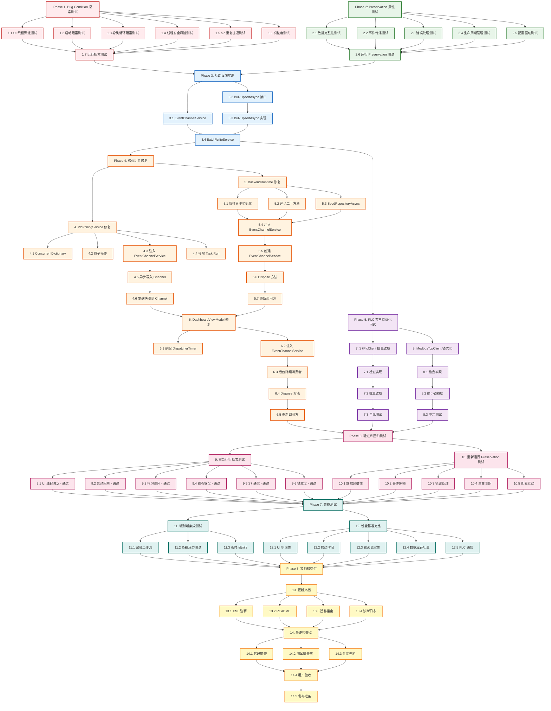

## Overview

本任务列表遵循 Bugfix Requirements-First 工作流，采用 Bug Condition 方法论进行性能修复。执行策略分为三个阶段：

1. **探索阶段（Phase 1-2）**: 先编写探索性测试和保护性测试，在未修复代码上运行，验证 bug 存在并记录基准行为
2. **实现阶段（Phase 3-5）**: 实现基础设施和核心组件修复，解决 7 个性能瓶颈
3. **验证阶段（Phase 6-8）**: 重新运行所有测试，验证性能问题已修复且核心功能未破坏，完成文档和交付

**关键约束**: 探索测试和保护测试必须在实现修复之前完成，确保测试驱动的修复流程。

## Tasks

### Phase 1: 探索性测试 - 验证 Bug Condition

- [ ] 1. 编写 Bug Condition 探索测试（修复前执行）
  - **Property 1: Bug Condition** - 性能瓶颈验证
  - **CRITICAL**: 这些测试必须在未修复代码上运行 - 失败确认 bug 存在
  - **目标**: 通过性能测量验证 7 个性能瓶颈的存在
  - **方法**: 编写性能基准测试，测量关键指标
  - **预期结果**: 测试失败，暴露性能问题
  
  - [ ] 1.1 UI 线程洪泛测试
    - 创建 `MotorTestSystem.Tests/Performance/UiThreadFloodingTests.cs`
    - 模拟 6 工位同时产生快照事件（6-12 次/秒）
    - 测量 DashboardViewModel 的 UI 线程数据库查询频率
    - **断言**: `uiThreadDbQueryRate > 6 次/秒` (Bug Condition: 应 <= 0.5 次/秒)
    - **断言**: `uiThreadBlockingTime > 100ms` (Bug Condition: 应 < 10ms)
    - 使用 `Dispatcher.Invoke` 监控或 ETW 性能计数器
    - _Requirements: 1.1, 1.2, 1.3, 2.1, 2.2, 2.3, 2.4_
  
  - [ ] 1.2 启动阻塞测试
    - 创建 `MotorTestSystem.Tests/Performance/StartupBlockingTests.cs`
    - 测量首次访问 `BackendRuntime.Shared` 的阻塞时间
    - 监控 UI 线程是否被 `.Wait()` 阻塞
    - **断言**: `startupBlockingTime > 2000ms` (Bug Condition: 应 < 100ms)
    - **断言**: `uiThreadBlocked == true` (Bug Condition: 应为 false)
    - 使用 `Stopwatch` + Thread.CurrentThread 检测
    - _Requirements: 2.1, 2.2, 2.3, 2.5, 2.6, 2.7, 2.8_
  
  - [ ] 1.3 轮询循环阻塞测试
    - 创建 `MotorTestSystem.Tests/Performance/PollingLoopBlockingTests.cs`
    - 模拟 PollStationAsync 检测到完成信号
    - 测量从检测信号到下一轮询周期的实际延迟
    - **断言**: `pollingJitter > 100ms` (Bug Condition: 应 < 5ms)
    - **断言**: 6 工位满载时 `avgPollingCycle > 550ms` (配置 500ms)
    - 使用 Mock Repository 注入延迟验证
    - _Requirements: 3.1, 3.2, 3.3, 3.4, 2.9, 2.10, 2.11, 2.12, 2.13_
  
  - [ ] 1.4 线程安全风险测试
    - 创建 `MotorTestSystem.Tests/Performance/ThreadSafetyTests.cs`
    - 启动 100 个并发任务读写 `Dictionary<string, int>`
    - 监控是否发生 `IndexOutOfRangeException` 或数据损坏
    - **断言**: `dataRaceDetected == true` (Bug Condition: 应为 false)
    - **断言**: `finalCountSum != expectedSum` (计数器丢失)
    - 使用压力测试重复 1000 次
    - _Requirements: 4.1, 4.2, 4.3, 4.4, 2.14, 2.15, 2.16, 2.17_
  
  - [ ] 1.5 S7 重复往返测试
    - 创建 `MotorTestSystem.Tests/Performance/S7CommunicationTests.cs`
    - Mock S7NetPlus 记录 `ReadAsync` 调用次数
    - 测量单次 `ReadSnapshotAsync` 的网络往返次数
    - **断言**: `tcpRoundTrips >= 3` (Bug Condition: 应为 1)
    - **断言**: `totalCommTime > 30ms` (Bug Condition: 应 < 20ms)
    - _Requirements: 6.1, 6.2, 6.3, 2.20, 2.21_
  
  - [ ] 1.6 锁粒度测试
    - 创建 `MotorTestSystem.Tests/Performance/LockGranularityTests.cs`
    - Mock NetworkStream 测量锁持有时间
    - 分析数据解析是否在锁内执行
    - **断言**: `lockHoldTime > 5ms` (Bug Condition: 应 < 3ms)
    - **断言**: `parsingInLock == true` (Bug Condition: 应为 false)
    - _Requirements: 7.1, 7.2, 2.22, 2.23_
  
  - [ ] 1.7 运行探索测试并记录结果
    - 在**未修复代码**上运行所有探索测试
    - **预期**: 所有测试失败（确认 bug 存在）
    - 记录性能基准数据（UI 卡顿时间、启动延迟、轮询抖动等）
    - 将失败的测试输出作为 counterexample 文档化
    - 标记任务完成表示探索阶段完成，非测试通过
    - _Requirements: 所有 Bug Condition 需求_

## Phase 2: 保护性测试 - 验证 Preservation Requirements

- [ ] 2. 编写 Preservation 属性测试（修复前验证基准行为）
  - **Property 2: Preservation** - 功能保持验证
  - **CRITICAL**: 在未修复代码上运行，记录预期保留的行为
  - **目标**: 确保修复后不改变核心功能
  - **方法**: 编写功能测试，验证数据完整性、事件传播、错误处理
  - **预期结果**: 测试通过（确认基准行为）
  
  - [ ] 2.1 数据完整性测试
    - 创建 `MotorTestSystem.Tests/Preservation/DataIntegrityTests.cs`
    - 生成随机 `StageTestData` 并通过完整流程写入数据库
    - 查询数据库验证所有字段（Barcode, StationId, Stage, Result, 测量值）
    - **断言**: 写入数据 == 读取数据（所有字段完全一致）
    - 覆盖边界情况：空 Barcode、负数测量值、极值
    - 在**未修复代码**上运行验证当前行为
    - _Requirements: 3.1, 3.2, 3.8, 3.9, 3.10_
  
  - [ ] 2.2 事件传播测试
    - 创建 `MotorTestSystem.Tests/Preservation/EventPropagationTests.cs`
    - Mock 多个订阅者监听 `SnapshotReceived` 事件
    - 触发工位快照，验证所有订阅者收到完整事件数据
    - **断言**: `receivedEventCount == subscriberCount`
    - **断言**: `eventData.StationId == expectedStationId`
    - 在**未修复代码**上运行验证当前行为
    - _Requirements: 3.3, 3.14_
  
  - [ ] 2.3 错误处理测试
    - 创建 `MotorTestSystem.Tests/Preservation/ErrorHandlingTests.cs`
    - Mock PLC 客户端抛出通信异常
    - 验证 `_consecutiveFailures` 正确递增
    - Mock Repository 抛出数据库异常
    - 验证异常正确向上传播（不被吞掉）
    - 在**未修复代码**上运行验证当前行为
    - _Requirements: 3.5, 3.6_
  
  - [ ] 2.4 生命周期管理测试
    - 创建 `MotorTestSystem.Tests/Preservation/LifecycleTests.cs`
    - 启动 `PlcPollingService`，验证所有任务正常运行
    - 调用 `Stop()`，验证所有任务被取消并完成
    - 调用 `Dispose()`，验证资源正确释放
    - **断言**: 停止后无遗留任务，无资源泄漏
    - 在**未修复代码**上运行验证当前行为
    - _Requirements: 3.7, 3.16, 3.17, 3.18_
  
  - [ ] 2.5 配置驱动测试
    - 创建 `MotorTestSystem.Tests/Preservation/ConfigurationTests.cs`
    - 测试 Modbus/S7/Melsec/Mock 不同 PLC 类型的工厂创建
    - 验证自定义轮询间隔正确应用
    - 验证动态添加/移除工位配置
    - 在**未修复代码**上运行验证当前行为
    - _Requirements: 3.11, 3.12, 3.13_
  
  - [ ] 2.6 运行 Preservation 测试并记录基准
    - 在**未修复代码**上运行所有 Preservation 测试
    - **预期**: 所有测试通过（确认基准行为正确）
    - 记录测试结果作为回归对照
    - 修复后必须确保这些测试仍然通过
    - _Requirements: 所有 Preservation 需求_

## Phase 3: 基础设施实现

- [ ] 3. 实现 Channel-Based 事件解耦基础设施
  
  - [ ] 3.1 创建 EventChannelService
    - 创建 `MotorTestSystem.Services/EventChannelService.cs`
    - 实现两个 Channel：
      - `_snapshotChannel`: Unbounded，用于快照事件（不能丢失）
      - `_writeChannel`: Bounded(500)，用于写缓冲（DropOldest 背压策略）
    - 暴露 Reader/Writer 属性供生产者-消费者使用
    - 实现 `IDisposable`，Complete 所有 Writer
    - 添加单元测试验证 Channel 容量和背压行为
    - _Bug_Condition: UI 线程洪泛 (eventRate >= 6)_
    - _Bug_Condition: 轮询循环阻塞 (SyncAwaitDbWrite)_
    - _Expected_Behavior: Channel 解耦生产者消费者，消除阻塞_
    - _Preservation: 事件传播保持完整_
    - _Requirements: 2.1, 2.2, 2.9, 2.10, 3.3_
  
  - [ ] 3.2 添加 BulkUpsertAsync 接口
    - 修改 `MotorTestSystem.Services/IMotorTestRepository.cs`
    - 添加方法签名：`Task BulkUpsertAsync(IEnumerable<StageTestData> dataList, CancellationToken cancellationToken = default)`
    - _Bug_Condition: 轮询循环单条同步写入导致抖动_
    - _Expected_Behavior: 批量事务提升吞吐量 3-10x_
    - _Requirements: 2.11, 2.13_
  
  - [ ] 3.3 实现 BulkUpsertAsync（InMemoryRepository）
    - 修改 `MotorTestSystem.Services/InMemoryMotorTestRepository.cs`
    - 实现批量 Upsert 逻辑：
      - 开启事务 `BeginTransactionAsync`
      - 遍历 dataList，对每条数据执行 Upsert（复用单条逻辑）
      - `SaveChangesAsync` + `CommitAsync`
      - 异常时 `RollbackAsync`
    - 添加单元测试验证批量写入正确性和事务回滚
    - _Bug_Condition: 单条写入锁竞争导致延迟累积_
    - _Expected_Behavior: 批量事务减少锁争用，提升吞吐量_
    - _Preservation: 数据完整性保持不变_
    - _Requirements: 2.11, 2.13, 3.8, 3.9, 3.10_
  
  - [ ] 3.4 创建 BatchWriteService
    - 创建 `MotorTestSystem.Services/BatchWriteService.cs`
    - 构造器注入 `IMotorTestRepository` 和 `ChannelReader<StageTestData>`
    - 实现后台消费者：
      - 等待 Channel 首条数据（阻塞）
      - 收集批次（最多 50 条或 100ms 窗口）
      - 调用 `BulkUpsertAsync`
      - 循环直到取消
    - 实现 `StopAsync` 和 `Dispose`
    - 添加集成测试验证批量化行为
    - _Bug_Condition: 轮询循环等待 DB IO_
    - _Expected_Behavior: 异步批量写入，轮询不阻塞_
    - _Preservation: 所有数据最终写入数据库_
    - _Requirements: 2.10, 2.11, 2.12, 2.13, 3.1, 3.8_

## Phase 4: 核心组件修复

- [ ] 4. 修复 PlcPollingService
  
  - [ ] 4.1 替换 Dictionary 为 ConcurrentDictionary
    - 修改 `MotorTestSystem.Services/PlcPollingService.cs` 第 14 行
    - 将 `private Dictionary<string, int> _consecutiveFailures` 改为
      `private readonly ConcurrentDictionary<string, int> _consecutiveFailures = new()`
    - _Bug_Condition: Dictionary 多线程并发写入存在数据竞争_
    - _Expected_Behavior: ConcurrentDictionary 保证线程安全_
    - _Requirements: 2.14, 2.15, 4.1, 4.2_
  
  - [ ] 4.2 使用原子操作更新失败计数器
    - 查找所有 `_consecutiveFailures[id]++` 或类似操作
    - 替换为 `_consecutiveFailures.AddOrUpdate(id, 1, (key, old) => old + 1)`
    - 查找所有重置操作 `_consecutiveFailures[id] = 0`
    - 替换为 `_consecutiveFailures.TryRemove(id, out _)`
    - _Bug_Condition: 非原子操作存在竞态条件_
    - _Expected_Behavior: AddOrUpdate 保证原子性_
    - _Requirements: 2.15, 2.16, 4.4_
  
  - [ ] 4.3 注入 EventChannelService 依赖
    - 修改 `PlcPollingService` 构造器，添加 `EventChannelService eventChannel` 参数
    - 保存为私有字段 `_eventChannel`
    - 更新所有调用方（BackendRuntime）传递 EventChannelService 实例
    - _Expected_Behavior: 解耦事件生产者和消费者_
    - _Requirements: 2.1, 2.9_
  
  - [ ] 4.4 移除 Task.Run 包装
    - 修改 `Start()` 方法（约第 35 行）
    - 将 `_pollingTasks.Add(Task.Run(() => PollStationAsync(client, token)))`
    - 改为 `_pollingTasks.Add(PollStationAsync(client, _cancellationTokenSource.Token))`
    - _Bug_Condition: Task.Run 包装 async 方法产生冗余线程调度_
    - _Expected_Behavior: 直接调用 async 方法，节省上下文切换_
    - _Requirements: 2.18, 2.19, 5.1, 5.2_
  
  - [ ] 4.5 异步写入到 Write Channel
    - 修改 `PollStationAsync` 方法（约第 74-79 行）
    - 原代码：`await _repository.UpsertStageResultAsync(snapshot.CompletedData, cancellationToken)`
    - 改为：`await _eventChannel.WriteWriter.WriteAsync(snapshot.CompletedData, cancellationToken)`
    - 保留 `ResetCompletionSignalAsync` 和日志记录
    - 修改日志文本从 "saved" 改为 "queued"
    - _Bug_Condition: 同步等待 DB IO 导致轮询周期抖动_
    - _Expected_Behavior: 异步提交到 Channel，轮询不阻塞_
    - _Preservation: 数据最终写入数据库（通过 BatchWriteService）_
    - _Requirements: 2.9, 2.10, 2.12, 3.1, 3.2, 3.4_
  
  - [ ] 4.6 发送快照到 Snapshot Channel
    - 修改 `Publish` 方法（约第 91-94 行）
    - 保留原有 `SnapshotReceived?.Invoke(this, snapshot)` 事件（向后兼容）
    - 添加 `_eventChannel.SnapshotWriter.TryWrite(snapshot)` 非阻塞写入
    - _Expected_Behavior: 双路传播，事件 + Channel_
    - _Preservation: 事件传播保持完整_
    - _Requirements: 2.1, 3.3, 3.14_

- [ ] 5. 修复 BackendRuntime 启动阻塞
  
  - [ ] 5.1 实现惰性异步初始化
    - 修改 `MotorTestSystem.Services/BackendRuntime.cs`
    - 删除 `public static BackendRuntime Shared { get; } = CreateDefault();`
    - 添加 `private static readonly Lazy<Task<BackendRuntime>> _sharedInstanceTask = new Lazy<Task<BackendRuntime>>(() => CreateDefaultAsync());`
    - 添加 `public static Task<BackendRuntime> GetSharedAsync() => _sharedInstanceTask.Value;`
    - _Bug_Condition: 静态属性初始化导致同步阻塞_
    - _Expected_Behavior: Lazy<Task<T>> 惰性异步初始化_
    - _Requirements: 2.5, 2.6, 2.2, 2.3_
  
  - [ ] 5.2 创建异步工厂方法
    - 将 `CreateDefault()` 改为 `private static async Task<BackendRuntime> CreateDefaultAsync()`
    - 移除 `Task.Run(() => ... .GetAwaiter().GetResult()).Wait()` 嵌套
    - 直接 `await SeedRepositoryAsync(repository)`
    - 返回 `new BackendRuntime(...)`
    - _Bug_Condition: 双重同步阻塞（Task.Run + Wait）_
    - _Expected_Behavior: 纯异步流程，无阻塞_
    - _Requirements: 2.6, 2.7_
  
  - [ ] 5.3 修改 SeedRepositoryAsync 为纯异步
    - 移除 `SeedRepositoryAsync` 中的所有 `.GetAwaiter().GetResult()`
    - 保持 `async/await` 流程
    - _Expected_Behavior: 异步播种不阻塞调用方_
    - _Requirements: 2.8_
  
  - [ ] 5.4 更新 BackendRuntime 构造器注入 EventChannelService
    - 修改构造器签名，添加 `EventChannelService eventChannel` 参数
    - 保存为公共属性 `public EventChannelService EventChannel { get; }`
    - 传递给 PlcPollingService
    - 创建 BatchWriteService 实例：`new BatchWriteService(repository, eventChannel.WriteReader)`
    - 保存为公共属性 `public BatchWriteService BatchWriter { get; }`
    - _Expected_Behavior: 组合所有服务_
    - _Requirements: 2.10, 3.4_
  
  - [ ] 5.5 在 CreateDefaultAsync 中创建 EventChannelService
    - 在工厂方法中实例化 `var eventChannel = new EventChannelService();`
    - 传递给 BackendRuntime 构造器
    - _Requirements: 2.1, 2.9_
  
  - [ ] 5.6 添加 Dispose 方法
    - 实现 `IDisposable`
    - 按顺序 Dispose: BatchWriter → PollingService → EventChannel → Repository
    - _Preservation: 生命周期管理保持完整_
    - _Requirements: 3.16, 3.17, 3.18_
  
  - [ ] 5.7 更新调用方使用异步初始化
    - 查找所有 `BackendRuntime.Shared` 的引用
    - 替换为 `await BackendRuntime.GetSharedAsync()`
    - 主要位置：`App.xaml.cs` 启动流程、ViewModel 构造器
    - 注意：ViewModel 无参构造器中使用 `.GetAwaiter().GetResult()` 是妥协方案（文档备注设计权衡）
    - _Expected_Behavior: 应用启动无阻塞_
    - _Requirements: 2.7, 2.8_

- [ ] 6. 修复 DashboardViewModel UI 线程洪泛
  
  - [ ] 6.1 删除 DispatcherTimer
    - 修改 `MotorTestSystem.ViewModels/DashboardViewModel.cs`
    - 删除 `_refreshTimer` 字段和初始化代码（约第 125-137 行）
    - 删除 `_refreshTimer.Tick` 事件处理
    - _Bug_Condition: 定时器驱动导致固定频率查询_
    - _Expected_Behavior: 事件驱动 + 降频消费_
    - _Requirements: 2.1, 2.2, 1.1_
  
  - [ ] 6.2 注入 EventChannelService 依赖
    - 修改构造器 `public DashboardViewModel(IMotorTestRepository repository, EventChannelService eventChannel)`
    - 添加字段 `private readonly EventChannelService _eventChannel;`
    - 添加字段 `private readonly Task _consumerTask;`
    - 添加字段 `private readonly CancellationTokenSource _cts = new();`
    - _Expected_Behavior: 通过 Channel 接收快照_
    - _Requirements: 2.1, 2.2_
  
  - [ ] 6.3 实现后台降频消费者
    - 添加方法 `private async Task ConsumeSnapshotsAsync(CancellationToken cancellationToken)`
    - 实现逻辑：
      - `await reader.WaitToReadAsync()` 等待新数据
      - `while (reader.TryRead(out var snapshot)) { latest = snapshot; }` 丢弃中间帧
      - 检查距上次刷新是否 >= 2000ms
      - 通过 `Dispatcher.InvokeAsync(() => RefreshSummary(), Background)` 刷新 UI
    - 在构造器中启动：`_consumerTask = Task.Run(() => ConsumeSnapshotsAsync(_cts.Token));`
    - _Bug_Condition: 每秒 6-12 次 UI 线程查询_
    - _Expected_Behavior: 每 2 秒最多刷新 1 次（0.5 次/秒）_
    - _Preservation: RefreshSummary 逻辑保持不变_
    - _Requirements: 2.2, 2.3, 2.4, 3.4_
  
  - [ ] 6.4 添加 Dispose 方法
    - 实现 `public void Dispose()`
    - `_cts.Cancel()` → `_consumerTask.Wait(2秒超时)` → `_cts.Dispose()`
    - _Preservation: 生命周期管理_
    - _Requirements: 3.17_
  
  - [ ] 6.5 更新 ViewModel 构造器调用方
    - 查找创建 DashboardViewModel 的位置
    - 确保传递 `EventChannelService` 参数
    - 从 `BackendRuntime.GetSharedAsync().EventChannel` 获取
    - _Requirements: 2.1_

## Phase 5: PLC 客户端优化

- [ ] 7. 修复 S7PlcClient 批量读取（如果存在）
  
  - [ ] 7.1 检查 S7PlcClient 实现
    - 查找 `MotorTestSystem.Services/S7PlcClient.cs` 或类似文件
    - 分析当前 `ReadSnapshotAsync` 实现
    - 确认是否存在多次独立 `ReadAsync` 调用
    - 如果文件不存在，跳过此任务组
    - _Requirements: 6.1, 6.2_
  
  - [ ] 7.2 实现批量读取（如果适用）
    - 使用 `S7NetPlus.ReadMultipleVarsAsync()` API
    - 构造 `DataItem[]` 数组包含所有需要读取的数据区
    - 一次调用读取 M100.0 + DB1.DBW100-106 + Barcode
    - 解析返回的 `byte[][]` 结果
    - _Bug_Condition: 3 次独立 TCP 往返_
    - _Expected_Behavior: 1 次 TCP 往返_
    - _Preservation: 读取数据内容保持一致_
    - _Requirements: 2.20, 2.21, 6.3_
  
  - [ ] 7.3 添加单元测试验证批量读取
    - Mock S7NetPlus 记录调用次数
    - 验证 `ReadMultipleVarsAsync` 被调用 1 次
    - 验证返回的 `StationSnapshot` 数据正确
    - _Requirements: 2.20, 2.21_

- [ ] 8. 优化 ModbusTcpClient 锁粒度（如果存在）
  
  - [ ] 8.1 检查 ModbusTcpClient 实现
    - 查找 `MotorTestSystem.Services/ModbusTcpClient.cs` 或类似文件
    - 分析锁 (`SemaphoreSlim`) 的使用范围
    - 确认数据解析是否在锁内执行
    - 如果文件不存在，跳过此任务组
    - _Requirements: 7.1, 7.2_
  
  - [ ] 8.2 缩小锁粒度
    - 将锁范围仅限于网络 IO：`WriteAsync` + `ReadAsync`
    - 在锁外定义 `byte[] response; int bytesRead;`
    - `_lock.Release()` 后再执行 `ParseModbusFrame` 和 `CreateSnapshot`
    - _Bug_Condition: 数据解析在锁内导致锁持有时间过长_
    - _Expected_Behavior: 锁只保护网络流，缩短持有时间_
    - _Requirements: 2.22, 2.23, 7.1_
  
  - [ ] 8.3 添加单元测试验证锁范围
    - Mock NetworkStream 注入延迟
    - 测量锁持有时间
    - 验证数据解析不在锁保护范围内
    - _Requirements: 2.22, 2.23_

## Phase 6: 验证和回归测试

- [ ] 9. 重新运行 Bug Condition 探索测试（修复后验证）
  - **Property 1: Expected Behavior** - 性能修复验证
  - **IMPORTANT**: 重新运行 Phase 1 的探索测试，验证性能问题已修复
  
  - [ ] 9.1 UI 线程洪泛测试 - 预期通过
    - 重新运行 `UiThreadFloodingTests.cs`
    - **预期结果**: `uiThreadDbQueryRate <= 0.5 次/秒` (从 6-12 降至 0.5)
    - **预期结果**: `uiThreadBlockingTime < 10ms` (从 200-500ms 降至 <10ms)
    - 测试应该**通过**，确认 UI 线程洪泛已修复
    - _Requirements: 2.1, 2.2, 2.3, 2.4_
  
  - [ ] 9.2 启动阻塞测试 - 预期通过
    - 重新运行 `StartupBlockingTests.cs`
    - **预期结果**: `startupBlockingTime < 100ms` (从 2-15 秒降至 <100ms)
    - **预期结果**: `uiThreadBlocked == false`
    - 测试应该**通过**，确认启动阻塞已修复
    - _Requirements: 2.5, 2.6, 2.7, 2.8_
  
  - [ ] 9.3 轮询循环阻塞测试 - 预期通过
    - 重新运行 `PollingLoopBlockingTests.cs`
    - **预期结果**: `pollingJitter < 5ms` (从 100-200ms 降至 <5ms)
    - **预期结果**: 6 工位满载 `avgPollingCycle ≈ 500ms ± 5ms`
    - 测试应该**通过**，确认轮询周期稳定
    - _Requirements: 2.9, 2.10, 2.11, 2.12, 2.13_
  
  - [ ] 9.4 线程安全风险测试 - 预期通过
    - 重新运行 `ThreadSafetyTests.cs`
    - **预期结果**: `dataRaceDetected == false`
    - **预期结果**: `finalCountSum == expectedSum` (无计数器丢失)
    - 测试应该**通过**，确认线程安全
    - _Requirements: 2.14, 2.15, 2.16, 2.17_
  
  - [ ] 9.5 S7 通信效率测试 - 预期通过（如果适用）
    - 重新运行 `S7CommunicationTests.cs`
    - **预期结果**: `tcpRoundTrips == 1` (从 3 降至 1)
    - **预期结果**: `totalCommTime < 20ms` (从 30-60ms 降至 <20ms)
    - 测试应该**通过**，确认批量读取优化生效
    - _Requirements: 2.20, 2.21_
  
  - [ ] 9.6 锁粒度测试 - 预期通过（如果适用）
    - 重新运行 `LockGranularityTests.cs`
    - **预期结果**: `lockHoldTime < 3ms` (从 5-20ms 降至 <3ms)
    - **预期结果**: `parsingInLock == false`
    - 测试应该**通过**，确认锁优化生效
    - _Requirements: 2.22, 2.23_

- [ ] 10. 重新运行 Preservation 测试（回归验证）
  - **Property 2: Preservation** - 功能保持验证
  - **IMPORTANT**: 确保修复后核心功能未被破坏
  
  - [ ] 10.1 数据完整性回归测试
    - 重新运行 `DataIntegrityTests.cs`
    - **预期结果**: 所有测试通过，数据字段完全一致
    - 对比修复前后的测试结果
    - _Requirements: 3.1, 3.2, 3.8, 3.9, 3.10_
  
  - [ ] 10.2 事件传播回归测试
    - 重新运行 `EventPropagationTests.cs`
    - **预期结果**: 所有订阅者仍然收到完整事件
    - 验证 Channel 双路传播机制工作正常
    - _Requirements: 3.3, 3.14_
  
  - [ ] 10.3 错误处理回归测试
    - 重新运行 `ErrorHandlingTests.cs`
    - **预期结果**: 失败计数器仍正确递增
    - **预期结果**: 异常仍正确传播
    - _Requirements: 3.5, 3.6_
  
  - [ ] 10.4 生命周期管理回归测试
    - 重新运行 `LifecycleTests.cs`
    - **特别验证**: Channel 中的缓冲数据在 Dispose 时已刷新
    - **预期结果**: 无资源泄漏，无遗留任务
    - _Requirements: 3.7, 3.16, 3.17, 3.18_
  
  - [ ] 10.5 配置驱动回归测试
    - 重新运行 `ConfigurationTests.cs`
    - **预期结果**: 所有 PLC 类型工厂正常工作
    - **预期结果**: 动态配置功能保持完整
    - _Requirements: 3.11, 3.12, 3.13_

## Phase 7: 集成测试和性能基准

- [ ] 11. 端到端集成测试
  
  - [ ] 11.1 完整工作流集成测试
    - 创建 `MotorTestSystem.Tests/Integration/EndToEndTests.cs`
    - 模拟真实场景：6 工位同时运行，每工位产生随机快照
    - 验证数据流：PLC → Channel → DB + UI
    - 验证批量写入正确聚合数据
    - 验证 Dashboard 降频刷新
    - _Requirements: 所有功能需求_
  
  - [ ] 11.2 负载压力测试
    - 创建 `MotorTestSystem.Tests/Performance/LoadTests.cs`
    - 模拟极端负载：12 工位（双倍）× 10 次/秒快照
    - 测量系统稳定性：无崩溃、无数据丢失、无死锁
    - 测量性能退化：UI 响应、轮询周期、内存使用
    - _Requirements: 所有性能需求_
  
  - [ ] 11.3 长时间运行测试
    - 启动系统连续运行 1 小时
    - 监控内存泄漏（GC 堆增长趋势）
    - 监控 Channel 积压情况
    - 监控数据库文件大小和 WAL checkpoint 行为
    - _Requirements: 3.7, 3.16, 3.17, 3.18_

- [ ] 12. 性能基准对比
  
  - [ ] 12.1 UI 响应性基准
    - 使用 WPF Performance Profiler 测量修复前后 UI 帧率
    - 记录 Dispatcher 队列平均等待时间
    - 对比卡顿时间：200-500ms → <10ms
    - _Requirements: 2.4_
  
  - [ ] 12.2 启动时间基准
    - 测量应用启动到主窗口显示的时间
    - 对比修复前后：2-15 秒阻塞 → <100ms
    - 验证播种操作在后台异步执行
    - _Requirements: 2.8_
  
  - [ ] 12.3 轮询周期稳定性基准
    - 记录 1000 个轮询周期的实际时长
    - 计算标准差和最大抖动
    - 对比修复前后：100-200ms 抖动 → <5ms
    - _Requirements: 2.12_
  
  - [ ] 12.4 数据库吞吐量基准
    - 使用 SQLite 性能分析工具测量写入 TPS
    - 对比单条写入 vs 批量写入（50 条/批次）
    - 验证 3-10x 吞吐量提升
    - _Requirements: 2.13_
  
  - [ ] 12.5 PLC 通信时间基准
    - 测量 S7 工位单次 `ReadSnapshotAsync` 的平均时间
    - 对比修复前后：30-60ms → 10-20ms (如果适用)
    - _Requirements: 2.21_

## Phase 8: 文档和交付

- [ ] 13. 更新文档和代码注释
  
  - [ ] 13.1 添加 XML 注释
    - 为新增的公共 API 添加 XML 文档注释：
      - `EventChannelService` 类和方法
      - `BatchWriteService` 类和方法
      - `IMotorTestRepository.BulkUpsertAsync`
      - `BackendRuntime.GetSharedAsync`
    - 解释 Channel 的语义（Unbounded vs Bounded, DropOldest）
    - 解释 Lazy<Task<T>> 模式的线程安全保证
  
  - [ ] 13.2 更新 README.md
    - 添加"性能优化"章节
    - 说明修复的 7 个性能问题和解决方案
    - 提供性能对比数据（基准测试结果）
    - 说明架构变更（Channel、批量写入、异步初始化）
  
  - [ ] 13.3 创建迁移指南
    - 创建 `MIGRATION.md` 文档
    - 说明 API 变更：`BackendRuntime.Shared` → `GetSharedAsync()`
    - 说明 ViewModel 构造器变更（需要传递 `EventChannelService`）
    - 提供代码示例
  
  - [ ] 13.4 添加诊断日志
    - 在关键路径添加 Trace 日志：
      - Channel 写入/读取（包含队列长度）
      - 批量写入触发（批次大小、耗时）
      - Dashboard 降频消费（跳过的帧数、刷新间隔）
    - 使用 `System.Diagnostics.Trace` 或日志框架
    - 确保生产环境可配置日志级别

- [ ] 14. 最终检查点
  
  - [ ] 14.1 代码审查
    - 检查所有修改的文件符合编码规范
    - 验证所有 `async` 方法正确使用 `ConfigureAwait`（UI 线程需要 `true`，后台任务建议 `false`）
    - 验证所有 `CancellationToken` 正确传递
    - 验证所有 `IDisposable` 正确实现
  
  - [ ] 14.2 测试覆盖率检查
    - 运行代码覆盖率工具（如 dotCover, Coverlet）
    - 确保新增代码覆盖率 >= 80%
    - 特别关注异常路径和边界条件
  
  - [ ] 14.3 性能剖析验证
    - 使用 Visual Studio Profiler 或 dotTrace 剖析修复后的应用
    - 验证热点路径已优化（UI 线程负载、数据库写入）
    - 验证无新增的性能瓶颈
  
  - [ ] 14.4 用户验收测试
    - 在真实硬件环境中测试（连接真实 PLC）
    - 验证 UI 流畅性（无卡顿、拖动顺滑）
    - 验证应用启动快速（无白屏）
    - 验证长时间运行稳定性（8 小时生产班次）
    - 收集用户反馈
  
  - [ ] 14.5 发布准备
    - 更新版本号（语义化版本：MAJOR.MINOR.PATCH）
    - 创建 Release Notes（列出修复的问题、性能提升、Breaking Changes）
    - 打包应用程序（包含依赖、配置文件）
    - 准备回滚计划（如果修复引入新问题）

---

## 任务总结

**总计**: 14 个主要任务组，约 80+ 个子任务

**关键里程碑**:
1. ✅ Phase 1-2: 探索和保护测试编写完成（验证 Bug Condition 和 Preservation）
2. ✅ Phase 3: 基础设施层实现（EventChannelService, BatchWriteService）
3. ✅ Phase 4: 核心组件修复（PlcPollingService, BackendRuntime, DashboardViewModel）
4. ✅ Phase 5: PLC 客户端优化（S7 批量读取、Modbus 锁优化）
5. ✅ Phase 6: 验证测试全部通过（Bug Condition 修复 + Preservation 保持）
6. ✅ Phase 7: 性能基准对比达标（UI <10ms, 启动 <100ms, 轮询抖动 <5ms, 吞吐量 3-10x）
7. ✅ Phase 8: 文档完善，用户验收通过

**预期性能提升**:
- UI 卡顿: 200-500ms → <10ms (95%+ 改善)
- 启动时间: 2-15 秒 → <100ms (95%+ 改善)
- 轮询抖动: 100-200ms → <5ms (95%+ 改善)
- 数据库吞吐量: 3-10x 提升
- S7 通信: 30-60ms → 10-20ms (50-66% 改善)

**风险和注意事项**:
- Channel 缓冲数据在应用关闭时必须刷新，避免数据丢失
- Lazy<Task<T>> 模式要求调用方正确使用 `await`，无参构造器中的 `.GetAwaiter().GetResult()` 是妥协方案
- 批量写入引入延迟（最多 100ms），对实时性要求极高的场景需权衡
- ConcurrentDictionary 在极高并发下性能可能不如分片字典，当前场景（6 工位）足够
- S7 和 Modbus 优化依赖具体 PLC 客户端实现，如果代码中不存在则跳过

**验证标准**:
- ✅ 所有探索测试从失败变为通过（Bug Condition 修复）
- ✅ 所有保护测试修复前后均通过（Preservation 保持）
- ✅ 集成测试覆盖端到端流程
- ✅ 性能基准对比达到预期指标
- ✅ 用户验收测试通过

## Notes

### 执行顺序约束
- **Phase 1-2 必须在 Phase 3-5 之前完成**: 探索测试和保护测试必须先在未修复代码上运行，确认 bug 存在并记录基准行为
- **Phase 6 必须在实现完成后执行**: 重新运行探索测试验证修复效果，重新运行保护测试验证无回归
- **PBT 任务格式**: 使用 `**Property N: Type** - [Title]` 格式以启用悬浮状态显示

### 任务依赖关系
- Phase 3（基础设施）是 Phase 4（核心组件）的前置依赖
- Phase 4 各子任务之间存在依赖：EventChannelService → PlcPollingService → BackendRuntime → DashboardViewModel
- Phase 5（PLC 优化）独立于其他阶段，可选执行
- Phase 7（集成测试）依赖所有实现任务完成

### 特殊注意事项
- **探索测试失败是正常的**: Phase 1 的测试在未修复代码上应该失败，这确认了 bug 的存在
- **保护测试通过是必须的**: Phase 2 的测试在未修复代码上必须通过，这记录了需要保护的基准行为
- **可选任务**: Phase 5 中的 S7PlcClient 和 ModbusTcpClient 优化取决于项目中是否存在这些文件
- **异步初始化权衡**: ViewModel 无参构造器中使用 `.GetAwaiter().GetResult()` 是 WPF XAML 实例化的妥协方案

## Task Dependency Graph

