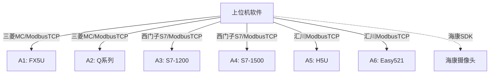
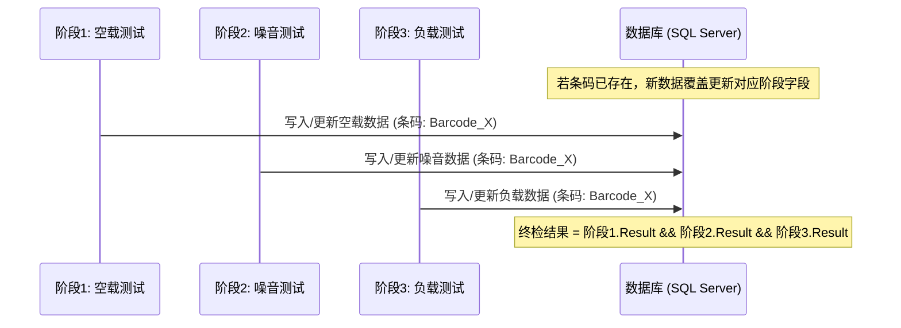

# 电机电性能测试系统上位机软件 - 产品需求文档 (PRD)

> [!NOTE]
> 本文档定义了电机组装完成后电性能测试系统的上位机监控与数据管理系统的产品需求与技术指标。

---

## 1. 项目概述

### 1.1 业务背景
在电机生产线的后道工序中，组装完成的电机需要通过电性能测试以验证其各项指标是否达标。本项目对应的测试系统涵盖了**空载测试**、**噪音测试**、**负载测试**三个阶段，涉及 6 个测试机台（每个阶段 2 个机台），分别由不同品牌和型号的 PLC 进行控制。

### 1.2 产品目标
1. **统一监控**：开发一套界面简洁美观的上位机软件，实时直观展示 6 个机台的运行状态及整条测试线的生产状态。
2. **数据追溯**：对每个电机的三阶段测试数据进行采集，按条码进行跨阶段汇总并持久化存储，支持后续的追溯与历史查询。
3. **生产看板**：实时统计日/月产量、良品/不良品数量（良率），并在软件中集成海康摄像头实时监控画面。

---

## 2. 系统架构与通信设计

### 2.1 硬件与物理拓扑
上位机（PC）作为核心节点，通过以太网与 6 台 PLC 进行数据交互：
*   **空载测试阶段**：机台 A1（三菱 FX5U）、机台 A2（三菱 Q系列）
*   **噪音测试阶段**：机台 A3（西门子 S7-1200）、机台 A4（西门子 S7-1500）
*   **负载测试阶段**：机台 A5（汇川 H5U）、机台 A6（汇川 Easy521）

### 2.2 数据采集与握手机制 (完成信号逻辑)
为了确保数据采集的完整性且不重复采集，上位机与各 PLC 之间采用基于“完成信号”的握手机制：
1. **PLC 侧测试完成**：PLC 完成当前测试，将测试结果、测量数据及电机条码写入对应的变量寄存器，随后将**【完成信号】寄存器写为 1**。
2. **上位机读取**：上位机轮询检测到【完成信号】为 1 时，立即读取当前机台的所有测试数据。
3. **完成复位**：上位机读取完成后，**将【完成信号】寄存器写为 0**，通知 PLC 准备下一次测试。

---

## 3. 业务流程与数据汇总逻辑

### 3.1 跨阶段数据汇总与覆盖机制
电机按顺序流经三个测试阶段。三个阶段的数据是独立采集的，上位机需要通过**【电机条码】**作为唯一主键，将散落在三个阶段的数据归纳合并。

*   **数据覆盖更新逻辑**：若相同电机条码被重复测试（重测），新采集的阶段数据应**覆盖**数据库中该电机的旧测试记录（或更新对应的字段内容）。
*   **漏检与缺失兼容**：系统允许测试阶段数据缺失（对应数据库字段为 `NULL`）。如果电机因流程异常漏测某阶段，数据库仍允许保存当前已采集的阶段数据。

### 3.2 最终检测结果判定
每个电机的最终检测结果由已测试阶段的单项结果共同决定：
$$\text{最终结果 (OK)} = \text{空载结果 (OK)} \land \text{噪音结果 (OK)} \land \text{负载结果 (OK)}$$
*   若所有进行的阶段测试均通过，则为 **OK**。
*   若有任意阶段检测为 NG，则判定为 **NG**。
*   若某阶段缺失（`NULL`），终检结果暂判定为 **NG**（或标记为“未完成”），直到所有必要阶段测试完成。

---

## 4. 详细 PLC 变量表与转换规则

### 4.1 空载测试阶段 (A1 - 三菱FX5U / A2 - 三菱Q)
通信协议：三菱 MC 协议 (TCP) 或 ModbusTCP。

| 变量名称 | 变量地址 | 数据类型 | 备注与数据转换规则 |
| :--- | :--- | :--- | :--- |
| **电机条码** | D1000 - D1049 | String | 100字节 (50寄存器)，ASCII 编码 |
| **空载电流** | D1050 | Int16 | 单位：A。**转换：读取值 / 1000** (保留3位小数) |
| **空载转速** | D1051 | Int16 | 单位：r/min。整数。 |
| **轴伸长度** | D1052 | Int16 | 单位：mm。**转换：读取值 / 1000** (保留3位小数) |
| **滚花直径** | D1053 | Int16 | 单位：mm。**转换：读取值 / 1000** (保留3位小数) |
| **完成信号** | D1060 | Int16 | 握手信号：PLC 写 1，上位机读完写 0。 |
| **运行状态** | D1061 | Int16 | 0-待机，1-运行，2-故障。 |
| **检测结果** | D1062 | Int16 | 1-OK，0-NG。 |

### 4.2 噪音测试阶段 (A3 - 西门子1200 / A4 - 西门子1500)
通信协议：西门子 S7 协议 (TCP)。

| 变量名称 | 变量地址 | 数据类型 | 备注与数据转换规则 |
| :--- | :--- | :--- | :--- |
| **电机条码** | DB10.DBB100-199 | String | 100字节，实际数据从第3字节起 (前2字节为西门子 String 长度定义头) |
| **正转噪音** | DB10.DBD200 | Float (Real) | 单位：dB。32位浮点数。 |
| **反转噪音** | DB10.DBD204 | Float (Real) | 单位：dB。32位浮点数。 |
| **噪音差值** | DB10.DBD208 | Float (Real) | 单位：dB。32位浮点数。 |
| **完成信号** | DB10.DBW212 | Int16 (Word) | 握手信号：PLC 写 1，上位机读完写 0。 |
| **运行状态** | DB10.DBW214 | Int16 (Word) | 0-待机，1-运行，2-故障。 |
| **检测结果** | DB10.DBW216 | Int16 (Word) | 1-OK，0-NG。 |

### 4.3 负载测试阶段 (A5 - 汇川H5U / A6 - 汇川Easy521)
通信协议：ModbusTCP 协议。

| 变量名称 | 变量地址 | 数据类型 | 备注与数据转换规则 |
| :--- | :--- | :--- | :--- |
| **电机条码** | D2000 - D2049 | String | 100字节 (50寄存器)，ASCII 编码 |
| **负载电流** | D2050 | Float | 单位：A。32位浮点数 (占D2050和D2051)。 |
| **负载转速** | D2052 | Int16 | 单位：r/min。整数（16位）。⚠️ 若现场PLC实际配置为32位双字，需更新为Int32且数据占D2052和D2053。 |
| **完成信号** | D2054 | Int16 | 握手信号：PLC 写 1，上位机读完写 0。 |
| **运行状态** | D2055 | Int16 | 0-待机，1-运行，2-故障。 |
| **检测结果** | D2056 | Int16 | 1-OK，0-NG。 |

---

## 5. 功能需求

### 5.1 模块 1：通信管理配置
1.  **连接设置**：支持单独配置 6 台 PLC 的 IP 地址、端口、通信站号及通信协议类型。
2.  **状态自诊断**：上位机需实时监控与 6 台 PLC 的连接状态，若发生断线，界面应有显眼的**断线警报**（闪烁或红灯），并在后台自动重连。

### 5.2 模块 2：生产监控主界面 (UI 布局)
1.  **顶部全局状态栏**：系统名称、当前登录人员、系统当前时间、6 个机台的在线/离线指示灯。
2.  **中部机台实时监视卡片**：
    *   分 3 列展示测试阶段（空载、噪音、负载），每列包含 2 个对应机台卡片。
    *   卡片包含：机台名称、运行状态指示灯（待机-黄/运行-绿/故障-红）、当前测试条码、各项实时测试参数及阶段检测结果（OK/NG）。
3.  **底部生产概况与系统日志**：展示最近采集的 10 条电机历史记录极简列表与系统日志。

### 5.3 模块 3：数据追溯与历史查询
1.  **多条件筛选**：支持按电机条码（模糊匹配）、检测时间范围、最终检测结果（全部/OK/NG）筛选。
2.  **数据展现**：使用数据表格（DataGrid）展示，缺失阶段测试的字段对应显示为 `NULL` 或“未测”。
3.  **数据导出**：支持一键导出查询记录为 Excel。

### 5.4 模块 4：数据看板与海康 SDK 集成
1.  **产量统计图表**：以直方图、折线图或饼图展示日产量、月产量、良品率与不良率。
2.  **海康 SDK 视频监控集成**：
    *   软件看板页面预留视频播放窗口，通过**集成海康官方 SDK 接口**接入并渲染摄像头的实时监控画面。
    *   后续需支持基于 SDK 的基本视频预览控制。

---

## 6. 数据库表设计 (SQL Server)

### 6.1 电机综合检测结果表 (MotorTestResult)

| 字段名 | 数据类型 | 允许空 | 约束 | 说明 |
| :--- | :--- | :--- | :--- | :--- |
| **Barcode** | VARCHAR(100) | 否 | 主键 | 电机条码 (唯一) |
| **TestTime** | DATETIME | 否 | - | 最终更新写入时间 (默认 GETDATE()) |
| **FinalResult** | VARCHAR(10) | 否 | - | 最终检测结果：OK / NG |
| **NoLoadCurrent** | DECIMAL(6,3) | 是 | - | 空载电流 (A)，漏检为 NULL |
| **NoLoadSpeed** | INT | 是 | - | 空载转速 (r/min)，漏检为 NULL |
| **ShaftLength** | DECIMAL(6,3) | 是 | - | 轴伸长度 (mm)，漏检为 NULL |
| **KnurlDiameter** | DECIMAL(6,3) | 是 | - | 滚花直径 (mm)，漏检为 NULL |
| **FwdNoise** | DECIMAL(5,2) | 是 | - | 正转噪音 (dB)，漏检为 NULL |
| **RevNoise** | DECIMAL(5,2) | 是 | - | 反转噪音 (dB)，漏检为 NULL |
| **NoiseDiff** | DECIMAL(5,2) | 是 | - | 噪音差值 (dB)，漏检为 NULL |
| **LoadCurrent** | DECIMAL(6,3) | 是 | - | 负载电流 (A)，漏检为 NULL |
| **LoadSpeed** | INT | 是 | - | 负载转速 (r/min)，漏检为 NULL |
| **NoLoadResult** | VARCHAR(10) | 是 | - | 空载阶段检测结果：OK / NG，漏检为 NULL |
| **NoiseResult** | VARCHAR(10) | 是 | - | 噪音阶段检测结果：OK / NG，漏检为 NULL |
| **LoadResult** | VARCHAR(10) | 是 | - | 负载阶段检测结果：OK / NG，漏检为 NULL |

---

## 7. 非功能性与性能要求

1.  **高频并发写入**：多线程异步轮询 6 台 PLC，轮询任务不应导致 UI 卡顿。数据持久化需在后台工作线程中队列处理，防止突发测试完成信号导致数据库拥堵。
2.  **重测与覆盖处理性能**：主键 `Barcode` 的更新逻辑应执行 `UPSERT` 逻辑（在 SQL Server 中使用 `MERGE` 语句或判断主键存在性），确保重测覆盖动作在 100ms 内完成。
3.  **SDK 健壮性**：海康 SDK 初始化与预览窗口需在独立窗体或 WPF 控件宿主（WindowsFormsHost）中安全加载，保证 SDK 报错时上位机核心数据采集流程不崩溃。
